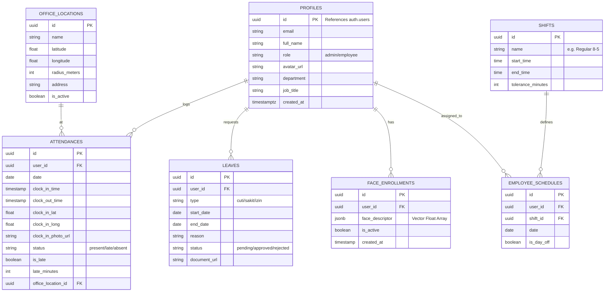
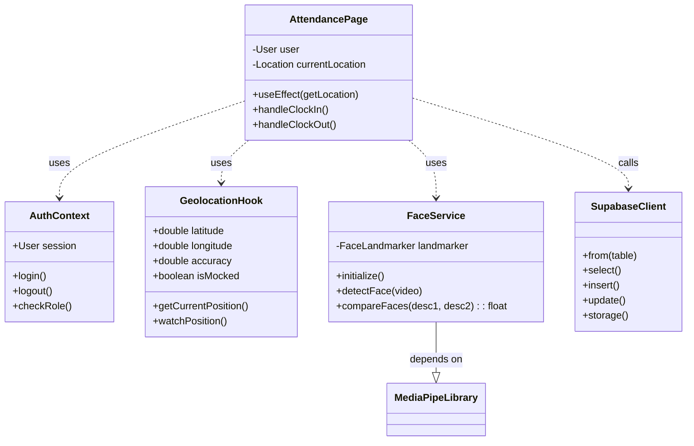

# Technical Diagrams & Architecture
# Absensi Ceria System

**Document ID:** ARCH-ABS-2026-001
**Date:** 27 January 2026

---

## 1. Entity Relationship Diagram (ERD)

Diagram ini menggambarkan struktur database dan relasi antar entitas dalam sistem.



---

## 2. UML Use Case Diagram

Menggambarkan interaksi aktor dengan fungsionalitas utama sistem.

```mermaid
usecaseDiagram
    actor "Karyawan (Staff)" as Staff
    actor "Administrator (HR)" as Admin
    
    package "Absensi Ceria System" {
        usecase "Login / Authentication" as UC1
        usecase "Face Enrollment (Daftar Wajah)" as UC2
        usecase "Absen Masuk (Clock In)" as UC3
        usecase "Absen Pulang (Clock Out)" as UC4
        usecase "Lihat Riwayat Absensi" as UC5
        usecase "Ajukan Izin/Cuti" as UC6
        
        usecase "Kelola Data Pegawai" as UC7
        usecase "Kelola Lokasi Kantor" as UC8
        usecase "Approval Izin" as UC9
        usecase "Laporan & Rekap" as UC10
    }

    Staff --> UC1
    Staff --> UC2
    Staff --> UC3
    Staff --> UC4
    Staff --> UC5
    Staff --> UC6

    Admin --> UC1
    Admin --> UC7
    Admin --> UC8
    Admin --> UC9
    Admin --> UC10
    
    UC3 ..> UC2 : <<include>> \n(Verifikasi Wajah)
    UC4 ..> UC3 : <<precondition>> \n(Harus sudah masuk)
```

---

## 3. System Flowchart (Alur Absensi Utama)

Alur logika teknis saat pengguna melakukan presensi, mencakup validasi Lokasi dan Biometrik.

```mermaid
flowchart TD
    Start([Mulai]) --> InitGPS[Inisialisasi GPS]
    InitGPS --> CheckGPS{GPS Aktif & Akurat?}
    
    CheckGPS -- Tidak (Akurasi > 50m) --> RetryGPS[Tampilkan Error 'Sinyal Lemah']
    RetryGPS --> InitGPS
    
    CheckGPS -- Ya --> CheckMock{Terdeteksi Fake GPS?}
    CheckMock -- Ya --> BlockApp[Blokir Akses & Log Fraud]
    BlockApp --> End([Selesai])
    
    CheckMock -- Tidak --> GetMode{Mode Kerja?}
    
    GetMode -- WFO (Office) --> CheckRadius{Dalam Radius Kantor?}
    CheckRadius -- Tidak (Jarak > Radius) --> OutBoundary[Tampilkan 'Diluar Jangkauan'] 
    OutBoundary --> End
    
    GetMode -- WFH / Field --> OpenCam[Buka Kamera]
    CheckRadius -- Ya --> OpenCam
    
    OpenCam --> DetectFace[Deteksi Wajah (AI)]
    DetectFace --> MatchFace{Wajah Cocok?}
    
    MatchFace -- Skor < 0.40 --> FailFace[Tolak: Wajah Tidak Dikenali]
    FailFace --> RetryCam[Coba Lagi]
    RetryCam --> DetectFace
    
    MatchFace -- Skor > 0.40 --> Capture[Ambil Foto Bukti]
    Capture --> Upload[Upload Data ke Server]
    
    Upload --> Success[Tampilkan Popup Sukses]
    Success --> End
```

---

## 4. UML Class Diagram (Simplified Architecture)

Menggambarkan struktur kelas/komponen utama di sisi Frontend (React) dan hubungannya.



---

## 5. Deployment Architecture (Topologi)

```mermaid
graph LR
    subgraph Client Device
        MobileApp[Mobile / PWA Client] -- HTTPS / WSS --> EdgeNet
        Camera[Camera Hardware] -.-> MobileApp
        GPS[GPS Receiver] -.-> MobileApp
    end

    subgraph "Cloud Infrastructure"
        EdgeNet[CDN / Edge Network] --> FrontendHost[Vercel Hosting]
        EdgeNet --> API[Supabase API Gateway]
        
        API --> Auth[Auth Service]
        API --> DB[(PostgreSQL Database)]
        API --> Storage[Object Storage (Photos)]
    end
```
