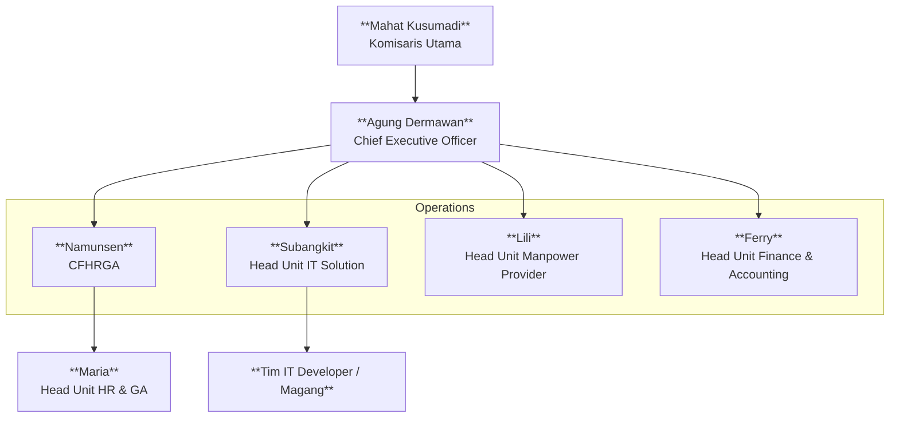
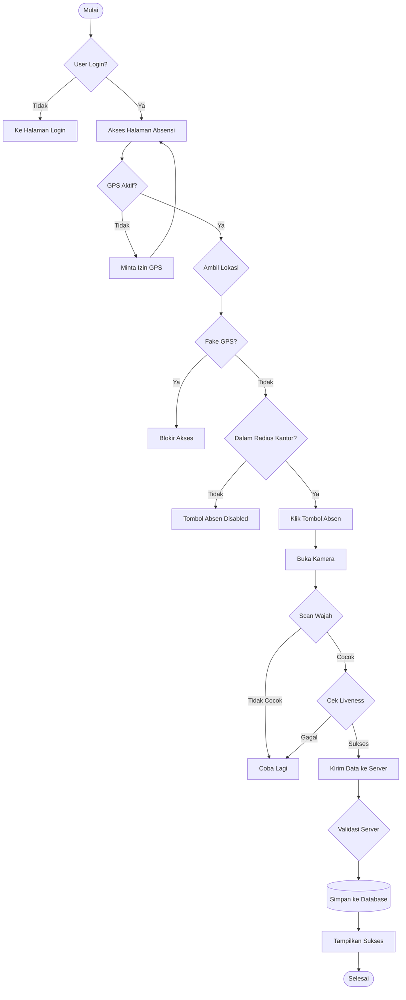
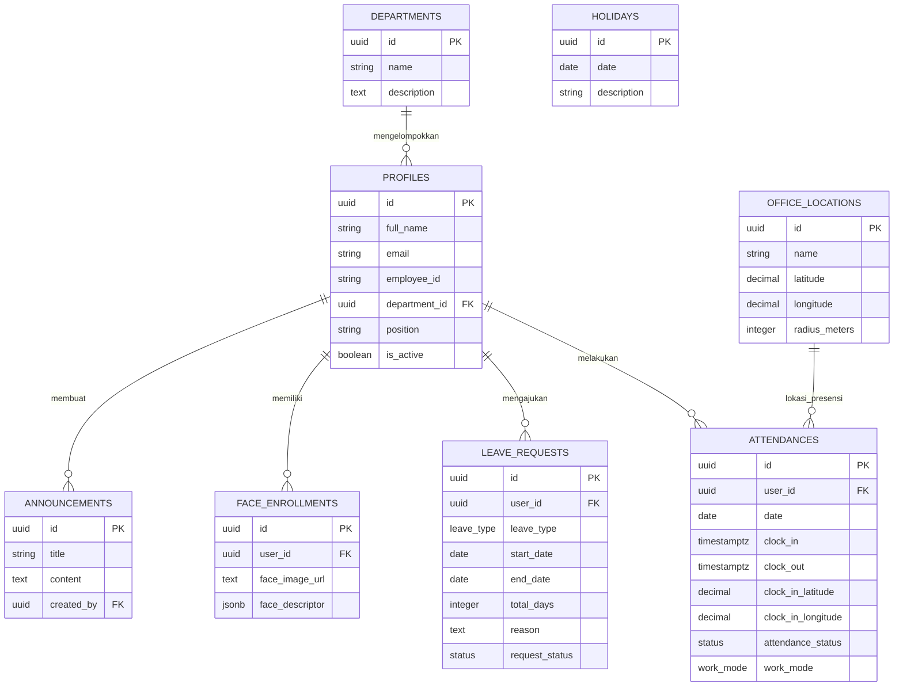

# LAPORAN PRAKTIK KERJA LAPANGAN (MAGANG)
**RANCANG BANGUN SISTEM HRIS DAN ABSENSI PINTAR ("DUTA MRUPUT ENTERPRISE") BERBASIS WEB DAN MOBILE PADA PT CMS DUTA SOLUSI**

<br>
<br>
<br>

**Disusun Oleh:**
Nama: [NAMA LENGKAP MAHASISWA]
NIM: [NOMOR INDUK MAHASISWA]
Program Studi: [PROGRAM STUDI]

<br>
<br>

**[LOGO KAMPUS]**

<br>
<br>

**[NAMA FAKULTAS]**
**[NAMA UNIVERSITAS]**
**TAHUN [TAHUN]**

---

<div style="page-break-after: always;"></div>

# LEMBAR PENGESAHAN

Laporan Praktik Kerja Lapangan (Magang) ini telah diperiksa dan disetujui oleh Pembimbing Lapangan dan Dosen Pembimbing sebagai pertanggungjawaban kegiatan magang yang dilaksanakan di **PT CMS Duta Solusi**.

<br>

**Judul Laporan**: Rancang Bangun Sistem HRIS dan Absensi Pintar ("Duta Mruput Enterprise") Berbasis Web dan Mobile
**Nama Mahasiswa**: [Nama Lengkap Mahasiswa]
**NIM**: [Nomor Induk Mahasiswa]
**Lokasi Magang**: PT CMS Duta Solusi

<br>
<br>

Disetujui di [Kota], Tanggal [Tanggal-Bulan-Tahun]

<br>
<br>

| Pembimbing Lapangan | Dosen Pembimbing |
| :---: | :---: |
| &nbsp;<br>&nbsp;<br>&nbsp;<br>_________________________<br>**[Nama Pembimbing Lapangan]**<br>Jabatan: [Jabatan] | &nbsp;<br>&nbsp;<br>&nbsp;<br>_________________________<br>**[Nama Dosen Pembimbing]**<br>NIP/NIDN: [Nomor Induk] |

<br>
<br>

Mengetahui,
Kaprodi [Nama Program Studi]

<br>
<br>
<br>

_________________________
**[Nama Kaprodi]**
NIP/NIDN: [Nomor Induk]

---

<div style="page-break-after: always;"></div>

# KATA PENGANTAR

Puji syukur kehadirat Tuhan Yang Maha Esa atas segala rahmat dan karunia-Nya, sehingga penulis dapat menyelesaikan Laporan Praktik Kerja Lapangan (Magang) dengan judul **"Rancang Bangun Sistem HRIS dan Absensi Pintar ('Duta Mruput Enterprise') Berbasis Web dan Mobile pada PT CMS Duta Solusi"**.

Laporan ini disusun sebagai salah satu syarat untuk menyelesaikan mata kuliah Praktik Kerja Lapangan pada Program Studi [Nama Prodi], [Nama Universitas]. Selama pelaksanaan magang dan penyusunan laporan ini, penulis mendapatkan banyak bimbingan, arahan, dan dukungan dari berbagai pihak. Oleh karena itu, penulis ingin menyampaikan terima kasih yang sebesar-besarnya kepada:

1.  Bapak/Ibu [Nama Pimpinan Perusahaan], selaku Pimpinan PT CMS Duta Solusi yang telah memberikan kesempatan magang.
2.  Bapak/Ibu [Nama Pembimbing Lapangan], selaku mentor di instansi yang telah membimbing teknis pengembangan aplikasi.
3.  Bapak/Ibu [Nama Dosen Pembimbing], yang telah memberikan arahan akademis dalam penyusunan laporan.
4.  Seluruh staff dan karyawan PT CMS Duta Solusi atas kerjasamanya.
5.  Orang tua dan teman-teman yang selalu memberikan dukungan moral.

Penulis menyadari bahwa laporan ini masih jauh dari kesempurnaan. Oleh karena itu, kritik dan saran yang membangun sangat diharapkan untuk perbaikan di masa mendatang. Semoga laporan ini dapat memberikan manfaat bagi pembaca, khususnya dalam pengembangan sistem informasi HRIS.

<br>

[Kota], [Bulan] [Tahun]

<br>
<br>

Penulis

---

<div style="page-break-after: always;"></div>

# ABSTRAK

**RANCANG BANGUN SISTEM HRIS DAN ABSENSI PINTAR ("DUTA MRUPUT ENTERPRISE") BERBASIS WEB DAN MOBILE PADA PT CMS DUTA SOLUSI**

Oleh:
[Nama Mahasiswa]
[NIM]

PT CMS Duta Solusi menghadapi tantangan dalam pengelolaan kehadiran karyawan lapangan yang masih dilakukan secara manual dan minim validasi, sehingga rentan terhadap manipulasi serta menyulitkan proses rekapitulasi penggajian. Kegiatan magang ini bertujuan untuk merancang dan membangun sistem informasi sumber daya manusia (*Human Resource Information System* - HRIS) yang terintegrasi untuk mengatasi permasalahan tersebut.

Sistem "Duta Mruput Enterprise" dikembangkan menggunakan platform web modern dengan *framework* **React.js** dan teknologi **Progressive Web App (PWA)** agar dapat diakses melalui perangkat *mobile* (Android/iOS) tanpa instalasi yang rumit. Sistem ini menerapkan fitur validasi ganda, yaitu **Geofencing** untuk membatasi lokasi absensi berdasarkan radius kantor menggunakan *Haversine Formula*, dan **Face Recognition** (MediaPipe) untuk verifikasi biometrik wajah pengguna. Layanan **Supabase** digunakan sebagai *Backend-as-a-Service* untuk menangani basis data *real-time* dan autentikasi.

Hasil pengujian menunjukkan bahwa sistem mampu memvalidasi kehadiran karyawan secara akurat, mencegah kecurangan manipulasi lokasi (*Fake GPS*), serta mempercepat proses perhitungan rekapitulasi gaji bulanan. Dengan adanya sistem ini, efisiensi operasional divisi HR meningkat signifikan karena data kehadiran tersedia secara *real-time*.

**Kata Kunci:** HRIS, Absensi Online, PWA, Geofencing, Face Recognition, React.js.

---

<div style="page-break-after: always;"></div>

# DAFTAR ISI

*   **HALAMAN JUDUL** ................................................................. i
*   **LEMBAR PENGESAHAN** ........................................................ ii
*   **KATA PENGANTAR** ............................................................. iii
*   **ABSTRAK** ........................................................................ iv
*   **DAFTAR ISI** ..................................................................... v
*   **DAFTAR GAMBAR** .............................................................. vi
*   **DAFTAR TABEL** ................................................................ vii

*   **BAB I PENDAHULUAN**
    *   1.1 Latar Belakang .......................................................... 1
    *   1.2 Alasan Magang ........................................................... 3
    *   1.3 Pentingnya Sistem & Masalah yang Ditemukan .............................. 4
    *   1.4 Tujuan Magang ........................................................... 5
    *   1.5 Manfaat Magang .......................................................... 6
    *   1.6 Ruang Lingkup Pekerjaan ................................................. 7
    *   1.7 Jadwal Kegiatan Magang .................................................. 8

*   **BAB II PROFIL INSTANSI**
    *   2.1 Sejarah Singkat Instansi ................................................ 9
    *   2.2 Visi dan Misi ........................................................... 10
    *   2.3 Struktur Organisasi ..................................................... 11
    *   2.4 Bidang Usaha dan Produk ................................................. 12
    *   2.5 Lokasi Instansi ......................................................... 13

*   **BAB III LANDASAN TEORI**
    *   3.1 Konsep Sistem Informasi SDM (HRIS) ...................................... 14
    *   3.2 Progressive Web Application (PWA) ....................................... 15
    *   3.3 Teknologi Frontend: React & TypeScript .................................. 17
    *   3.4 Backend as a Service (BaaS): Supabase ................................... 18
    *   3.5 Computer Vision & Biometrik (MediaPipe) ................................. 20
    *   3.6 Konsep Fitur-Fitur Sistem ............................................... 22
    *   3.7 Metodologi Pengembangan Sistem (Prototype) .............................. 24

*   **BAB IV ANALISIS DAN PERANCANGAN SISTEM**
    *   4.1 Analisis Sistem Berjalan ................................................ 26
    *   4.2 Perancangan Sistem (UML) ................................................ 28
    *   4.3 Perancangan Database (ERD) .............................................. 32
    *   4.4 Analisis Keamanan Sistem (Security) ..................................... 35

*   **BAB V IMPLEMENTASI DAN PEMBAHASAN**
    *   5.1 Implementasi Lingkungan Pengembangan .................................... 37
    *   5.2 Implementasi Fitur Utama ................................................ 39
    *   5.3 Antarmuka Pengguna (User Interface) ..................................... 45
    *   5.4 Pengujian Sistem (System Testing) ....................................... 48
    *   5.5 Pembahasan Hasil ........................................................ 50

*   **BAB VI PENUTUP**
    *   6.1 Kesimpulan .............................................................. 53
    *   6.2 Saran ................................................................... 54

*   **DAFTAR PUSTAKA** .............................................................. 55
*   **LAMPIRAN** .................................................................... 56

---

<div style="page-break-after: always;"></div>

<div style="text-align: center;">

**DAFTAR GAMBAR**

</div>

<br>

| Nomor | Judul Gambar | Halaman |
| :--- | :--- | :---: |
| Gambar 2.1 | Struktur Organisasi PT CMS Duta Solusi | 11 |
| Gambar 4.1 | Use Case Diagram Sistem Duta Mruput | 28 |
| Gambar 4.2 | Flowchart Alur Absensi | 30 |
| Gambar 4.3 | Entity Relationship Diagram (ERD) Basis Data | 32 |
| Gambar 5.1 | Struktur Direktori Proyek | 37 |
| Gambar 5.2 | Antarmuka Dashboard Karyawan | 46 |
| Gambar 5.3 | Visualisasi Geofencing pada Peta | 46 |
| Gambar 5.4 | Antarmuka Verifikasi Wajah | 46 |
| Gambar L3.1 | Struktur Folder Project pada VS Code | 57 |
| Gambar L3.2 | Kode Logika Absensi (Attendance.tsx) | 57 |

<div style="page-break-after: always;"></div>

<div style="text-align: center;">

**DAFTAR TABEL**

</div>

<br>

| Nomor | Judul Tabel | Halaman |
| :--- | :--- | :---: |
| Tabel 1.1 | Jadwal Kegiatan Magang | 8 |
| Tabel 5.1 | Hasil Pengujian Fungsional Sistem | 48 |

<div style="page-break-after: always;"></div>

# BAB I
# PENDAHULUAN

## 1.1 Latar Belakang

Di era transformasi digital saat ini, efisiensi operasional manajemen sumber daya manusia (SDM) menjadi kunci keberhasilan perusahaan. Sistem pencatatan kehadiran (absensi) dan pengelolaan data karyawan yang masih konvensional atau semi-digital seringkali menimbulkan inefisiensi. Metode manual seperti penggunaan kertas, *spreadsheet*, atau mesin *fingerprint* statis memiliki keterbatasan dalam hal fleksibilitas, akurasi *real-time*, dan rentan terhadap manipulasi atau *human error*.

**PT CMS Duta Solusi**, sebagai instansi yang terus berkembang, menyadari kebutuhan akan sistem manajemen SDM yang lebih modern, terintegrasi, dan dapat diakses secara *mobile*. Kebutuhan ini semakin mendesak mengingat dinamika kerja karyawan yang tidak selalu berada di satu titik lokasi (kantor pusat), melainkan juga tersebar di berbagai lokasi tugas atau bekerja secara *remote*.

Oleh karena itu, diperlukan sebuah solusi teknologi berupa aplikasi *Human Resource Information System* (HRIS) yang mampu menangani absensi berbasis lokasi (*geolocation*), validasi biometrik (*face recognition*) untuk mencegah kecurangan titip absen, serta manajemen pengajuan izin dan penggajian yang terpusat.

Melalui kegiatan Praktik Kerja Lapangan (Magang) ini, penulis berkesempatan untuk merancang dan membangun sistem tersebut yang diberi nama **"Duta Mruput Enterprise"**. Sistem ini dibangun menggunakan teknologi web modern (React.js) dan layanan backend berbasis *cloud* (Supabase) untuk memastikan ketersediaan data secara *real-time* dan keamanan yang handal.

## 1.2 Alasan Magang

Penulis memilih melaksanakan magang di PT CMS Duta Solusi dengan alasan:
1.  **Relevansi Teknologi:** Instansi memberikan kebebasan eksplorasi teknologi modern (*Tech Stack*: React, TypeScript, Supabase) yang sangat relevan dengan kebutuhan industri saat ini.
2.  **Peluang *Real-Project*:** Penulis dilibatkan langsung dalam pengembangan sistem inti (*core system*) yang akan digunakan secara operasional, bukan sekadar proyek simulasi.
3.  **Lingkungan Profesional:** Kesempatan untuk merasakan budaya kerja profesional, disiplin *deadline*, dan kolaborasi tim dalam siklus pengembangan perangkat lunak (*SDLC*).

## 1.3 Pentingnya Sistem di Instansi & Masalah yang Ditemukan

Sebelum adanya sistem aplikasi ini, pengelolaan SDM di instansi menghadapi beberapa kendala:
1.  **Validasi Kehadiran:** Sulit memantau karyawan yang bekerja di lapangan atau *mobile*. Mesin *fingerprint* hanya ada di kantor pusat.
2.  **Efisiensi Administrasi:** Rekapitulasi absensi bulanan untuk penggajian memakan waktu lama karena harus menarik data manual dan menggabungkannya dengan data izin/cuti kertas.
3.  **Transparansi:** Karyawan seringkali kesulitan mengetahui sisa cuti atau status persetujuan izin secara cepat.

Sistem "Duta Mruput Enterprise" dirancang untuk menyelesaikan masalah tersebut dengan menyediakan platform terpadu yang dapat diakses melalui *smartphone* masing-masing karyawan (BYOD - *Bring Your Own Device*).

## 1.4 Tujuan Magang

### 1.4.1 Tujuan Umum
1.  Memenuhi persyaratan kurikulum program studi [Nama Prodi] di [Nama Universitas].
2.  Mengimplementasikan ilmu dan teori yang telah dipelajari di bangku perkuliahan ke dalam dunia kerja nyata.
3.  Melatih kedisiplinan, tanggung jawab, dan etika profesional dalam lingkungan kerja.

### 1.4.2 Tujuan Khusus (Pengembangan Aplikasi)
1.  Merancang bangun aplikasi HRIS yang memiliki fitur utama: Absensi berbasis GPS & Wajah, Pengajuan Cuti, dan Informasi Kepegawaian.
2.  Mengimplementasikan algoritma *Face Recognition* (MediaPipe) pada platform web untuk validasi kehadiran.
3.  Menghasilkan laporan analisis dan dokumentasi teknis sistem yang dapat digunakan oleh instansi untuk pengembangan selanjutnya.

## 1.5 Manfaat Magang

### 1.5.1 Bagi Mahasiswa
*   Memperoleh pengalaman praktis dalam *Full Stack Web Development*.
*   Meningkatkan kemampuan pemecahan masalah (*problem solving*) dan analisis sistem.
*   Memperluas relasi dan wawasan tentang standar industri perangkat lunak.

### 1.5.2 Bagi Instansi (PT CMS Duta Solusi)
*   Mendapatkan purwarupa atau produk perangkat lunak (Sistem HRIS) yang dapat dimanfaatkan untuk efisiensi operasional.
*   Terjalinnya kerjasama akademis dengan universitas.
*   Mendapatkan bantuan tenaga terdidik dalam menyelesaikan permasalahan teknis di perusahaan.

### 1.5.3 Bagi Perguruan Tinggi
*   Mengetahui kesesuaian kurikulum dengan kebutuhan industri saat ini.
*   Sebagai bahan evaluasi untuk meningkatkan kualitas materi perkuliahan.

## 1.6 Ruang Lingkup Pekerjaan

Dalam pelaksanaan magang ini, penulis fokus pada pengembangan dan implementasi sistem dengan batasan sebagai berikut:

**Apa yang Dikerjakan:**
1.  **Frontend Development:** Membangun antarmuka pengguna (UI/UX) menggunakan **React.js, TypeScript, dan Tailwind CSS**.
2.  **Fitur Utama:**
    *   **Absensi Cerdas:** Presensi Masuk/Keluar dengan validasi ganda (Radius Geofencing & Deteksi Wajah).
    *   **Manajemen SDM:** Pengelolaan data karyawan, pengaturan Jadwal Kerja (Shift Pattern), dan Hari Libur Nasional.
    *   **Perizinan Digital:** Pengajuan dan persetujuan (Approval) Cuti, Sakit, dan Lembur secara berjenjang.
    *   **Monitoring Real-time:** Dashboard Admin untuk memantau kehadiran harian dan Peta Sebaran Lokasi Tim (*Live Team Map*).
    *   **Komunikasi Internal:** Fitur Papan Pengumuman (*Broadcast*) dan Agenda Perusahaan.
3.  **Backend Integration:** Menggunakan **Supabase** untuk Database (PostgreSQL), Autentikasi, dan Penyimpanan File (Storage).

**Apa yang Tidak Dikerjakan (Batasan Sistem):**
1.  **Platform Hybrid (PWA):** Aplikasi ini berjalan sebagai *Progressive Web App* (PWA) yang diakses melalui browser. Aplikasi belum dikompilasi menjadi *Native Mobile App* (file .APK android atau .IPA iOS) karena keterbatasan akun developer.
2.  **Fitur AI Eksperimental:** Validasi wajah menggunakan **MediaPipe Face Mesh** masih dalam tahap pengembangan (*Beta*). Fitur ini memiliki keterbatasan performa pada perangkat *low-end* dan sensitif terhadap kondisi pencahayaan, sehingga terkadang memerlukan proses *reload* atau pencahayaan tambahan.
3.  **Modul Penggajian (Payroll):** Fitur manajemen penggajian dan keuangan **tidak termasuk** dalam lingkup pengerjaan magang ini. Menu Payroll pada aplikasi hanya ditampilkan sebagai antarmuka sementara (*Mockup/Coming Soon*) dan pengembangan logika bisnisnya diserahkan sepenuhnya kepada tim pengembang internal perusahaan.
4.  **Hardware Legacy:** Sistem berjalan independen dan tidak terintegrasi dengan mesin absensi *fingerprint* lama yang sudah ada di kantor.

## 1.7 Jadwal Kegiatan Magang

Pelaksanaan magang berlangsung selama 2 Bulan (8 Minggu), berikut adalah matriks jadwal kegiatan yang telah dilaksanakan:

| Kegiatan / Minggu Ke- | 1 | 2 | 3 | 4 | 5 | 6 | 7 | 8 |
| :--- | :---: | :---: | :---: | :---: | :---: | :---: | :---: | :---: |
| **Analisis & Observasi** | ██ | | | | | | | |
| **Perancangan Sistem** | | ██ | | | | | | |
| **Pengembangan (Coding)** | | | ██ | ██ | ██ | ██ | | |
| **Testing & Integrasi** | | | | | | | ██ | |
| **Penyusunan Laporan** | | | | | | | | ██ |

<div style="text-align: center;">Tabel 1.1: Jadwal Kegiatan Magang</div>

---

<div style="page-break-after: always;"></div>

# BAB II
# PROFIL INSTANSI

## 2.1 Sejarah Singkat Instansi

**PT CMS Duta Solusi** merupakan anak perusahaan strategis di lingkungan Badan Penyelenggara Jaminan Sosial (BPJS) Kesehatan yang berfokus pada pengembangan solusi bisnis dan teknologi. Perusahaan ini telah memiliki legalitas yang kuat, salah satunya diperbarui melalui Keputusan Menteri Hukum dan HAM RI Nomor AHU-0020776.AH.01.02.Tahun 2025 tanggal 21 Maret 2025.

Kehadiran PT CMS Duta Solusi bertujuan untuk menjadi mitra strategis yang andal dalam menyediakan solusi terintegrasi. Perusahaan menggabungkan keahlian di bidang teknologi informasi (*IT Solution*), pendidikan bisnis (*Edu Tech*), dan penyediaan tenaga kerja (*Man Power Provider*). Dengan dukungan tim yang kompeten dan berpengalaman, perusahaan berkomitmen untuk mendorong efisiensi dan inovasi bagi para kliennya.

Selain melayani kebutuhan internal ekosistem kesehatan, PT CMS Duta Solusi juga menjalin kemitraan strategis dengan berbagai entitas teknologi besar, seperti **AdMedika (Telkom Group)**, untuk membangun ekosistem kesehatan digital yang terintegrasi di Indonesia.

## 2.2 Visi dan Misi

### 2.2.1 Visi
> "Menjadi perusahaan yang inovatif, kolaboratif, dan mampu memberikan nilai tambah bagi investor, mitra, dan pelanggan, serta berperan aktif dalam membangun ekosistem digital nasional."

### 2.2.2 Misi
1.  **Kolaborasi Strategis:** Melakukan kolaborasi dengan entitas bisnis serupa dalam rangka percepatan bisnis dan transfer pengetahuan.
2.  **Nilai Tambah (Value Added):** Memberikan nilai tambah bagi pelanggan melalui otomatisasi bisnis dan efisiensi biaya yang terukur.
3.  **Layanan Prima (Service Excellence):** Memberikan layanan prima kepada pelanggan dengan standar profesionalisme tinggi.

## 2.3 Struktur Organisasi

Struktur organisasi PT CMS Duta Solusi dipimpin oleh Komisaris Utama dan CEO yang membawahi berbagai unit strategis. Berdasarkan data perusahaan, bagan struktur organisasi adalah sebagai berikut:



<div style="text-align: center;">Gambar 2.1: Struktur Organisasi PT CMS Duta Solusi</div>

Penulis ditempatkan di bawah **Divisi Teknologi Informasi**, khususnya pada tim pengembangan perangkat lunak yang bertanggung jawab atas inisiatif digitalisasi internal perusahaan.

## 2.4 Bidang Usaha dan Produk

Lingkup kegiatan usaha PT CMS Duta Solusi mencakup berbagai layanan dan produk strategis, antara lain:

1.  **IT & Digital Solutions:**
    *   **Payment System & WhatsApp Blast Payment:** Solusi pembayaran digital terintegrasi.
    *   **Sistem Rekonsiliasi:** Platform pencocokan data keuangan otomatis.
    *   **SIMRS & LMS:** Sistem Informasi Manajemen Rumah Sakit & *Learning Management System*.
    *   **Digital SCF / SIF:** Layanan *Supply Chain Financing*.
    *   **Credit Scoring:** Analisis kredit berbasis data kesehatan.
    *   **Collection System:** Sistem manajemen penagihan.

2.  **Business Services & Event Management:**
    *   **Sertifikasi Kompetensi dan Pelatihan:** Program peningkatan *skill* SDM.
    *   **Event Management:** Pengorganisasian acara korporat profesional.
    *   **Pengadaan Seminar Kit:** Penyediaan kebutuhan seminar.
    *   **Tiket Perjalanan:** Layanan pemesanan transportasi korporat.

3.  **Man Power Provider:**
    *   Penyediaan tenaga kerja outsourcing yang kompeten dan berkualitas.

## 2.5 Lokasi Instansi

**PT CMS Duta Solusi**
[Alamat Lengkap Kantor, misal: Jl. Letjen Suprapto No. XX, Cempaka Putih]
[Kota, Kode Pos]
*Website: www.cmsdutasolusi.co.id*

---

<div style="page-break-after: always;"></div>

# BAB III
# LANDASAN TEORI

## 3.1 Konsep Sistem Informasi SDM (HRIS)

**Human Resource Information System (HRIS)** adalah sistem terintegrasi yang dirancang untuk membantu divisi SDM dalam mengelola data karyawan, proses penggajian (payroll), rekrutmen, pelatihan, hingga manajemen kehadiran. Dalam era digital, HRIS bertransformasi dari sekadar database arsip menjadi alat strategis untuk pengambilan keputusan (*Decision Support System*).

Pada proyek ini, HRIS difokuskan pada **Time & Attendance Management**, yaitu pengelolaan waktu kerja yang valid dan transparan untuk memastikan produktivitas karyawan.

## 3.2 Progressive Web Application (PWA)

Salah satu keputusan strategis utama dalam pengembangan aplikasi "Duta Mruput Enterprise" adalah penggunaan teknologi **Progressive Web App (PWA)**.

### 3.2.1 Definisi PWA
PWA adalah aplikasi web yang menggunakan kapabilitas web modern untuk menghadirkan pengalaman pengguna (UX) layaknya aplikasi native (Android/iOS). PWA dapat bekerja secara *offline*, mengirim notifikasi, dan diinstal ke layar utama (*Home Screen*) perangkat.

### 3.2.2 Alasan Pemilihan PWA (Cost & Deploy Efficiency)
Pengembangan aplikasi mobile konvensional seringkali terkendala oleh ekosistem tertutup (Walled Garden) dari Google Play Store dan Apple App Store.
1.  **Tanpa Akun Developer Berbayar:** Untuk menerbitkan aplikasi di App Store (iOS), pengembang dikenakan biaya $99/tahun, dan $25 (sekali bayar) untuk Google Play. Dengan PWA, aplikasi didistribusikan langsung melalui web tanpa biaya platform tersebut.
2.  **Kompatibilitas iOS & Android:** PWA bersifat *Cross-Platform*. Pengguna iOS dapat menggunakan fitur *"Add to Home Screen"* melalui Safari, dan pengguna Android melalui Chrome, tanpa perlu membuat dua kode program berbeda (Swift/Kotlin).
3.  **Update Instan:** Pembaruan aplikasi terjadi di sisi server. Pengguna tidak perlu men-download ulang update versi terbaru melalui Store.

## 3.3 Teknologi Frontend: React & TypeScript

### 3.3.1 React.js
Aplikasi ini dibangun menggunakan **React**, sebuah pustaka JavaScript populer untuk membangun antarmuka pengguna berbasis komponen (*Component-Based architecture*). React memungkinkan pembuatan UI yang interaktif dan *reusable*, seperti komponen *Card Karyawan*, *Navbar*, atau *Form Absensi*.

### 3.3.2 TypeScript
Untuk menjaga kualitas kode dan meminimalisir *bug* saat *runtime*, digunakan **TypeScript**. TypeScript adalah superset dari JavaScript yang menambahkan fitur *static typing*. Ini sangat krusial dalam aplikasi HRIS yang mengelola data sensitif (gaji/biodata), memastikan struktur data yang dikirim ke database sesuai dengan tipe yang didefinisikan.

## 3.4 Backend as a Service (BaaS): Supabase

Alih-alih membangun server backend tradisional, sistem ini memanfaatkan **Supabase**, sebuah platform BaaS *open source*.
*   **PostgreSQL:** Basis data relasional yang kuat untuk menyimpan data kompleks HRIS.
*   **Row Level Security (RLS):** Fitur keamanan database di mana aturan akses data didefinisikan langsung di level tabel. Contoh: "Karyawan A hanya boleh melihat slip gajinya sendiri, sedangkan HRD boleh melihat slip gaji semua orang."
*   **Realtime Subscriptions:** Memungkinkan dashboard admin menerima update otomatis saat ada karyawan yang baru saja melakukan absensi.

## 3.5 Computer Vision & Biometrik (MediaPipe)

Untuk validasi kehadiran, sistem menerapkan teknologi *Computer Vision* (Visi Komputer) menggunakan **Google MediaPipe Face Mesh**.

### 3.5.1 Konsep Face Mesh
MediaPipe Face Mesh adalah solusi pembelajaran mesin (*Machine Learning*) yang mampu memetakan 468 titik landmark 3D pada wajah manusia secara *real-time*. Teknologi ini berjalan di sisi klien (*Client-Side Inference*), artinya proses deteksi wajah terjadi di HP pengguna, bukan di server, sehingga menghemat biaya server.

### 3.5.2 Tantangan Implementasi & Status Pengembangan
Meskipun canggih, implementasi MediaPipe pada lingkungan browser (Web) memiliki tantangan tersendiri yang sedang dalam tahap penyempurnaan (Maintenance/Dev Status):
*   **Variasi Perangkat:** Performa deteksi sangat bergantung pada GPU/CPU *smartphone* pengguna.
*   **Pencahayaan:** Akurasi deteksi wajah menurun drastis pada kondisi cahaya minim (low light).
*   **Mirroring:** Isu teknis di mana orientasi kamera depan seringkali terbalik pada beberapa browser mobile tertentu.
Oleh karena itu, dalam laporan ini ditekankan bahwa fitur ini merupakan fitur eksperimental yang terus dikalibrasi akurasinya.

## 3.6 Konsep Fitur-Fitur Sistem

Sistem ini terdiri dari modul-modul fungsional yang dirancang berdasarkan proses bisnis perusahaan:

1.  **Location Based Service (LBS) / Geofencing:**
    Digunakan pada fitur **Absensi**. Sistem membandingkan koordinat GPS pengguna dengan koordinat kantor menggunakan *Haversine Formula*. Absen hanya valid jika jarak pengguna < Radius yang ditentukan (misal 50 meter).

2.  **Workflow Management (Approval System):**
    Diterapkan pada fitur **Cuti (Leave Request), Lembur (Overtime), dan Reimbursement**. Konsep ini mengatur alur data berjenjang: Pengajuan -> Pending -> Review Atasan -> Approved/Rejected.

3.  **Hierarchical Data Management:**
    Diterapkan pada **Manajemen Shift dan Divisi**. Mengatur relasi bahwa setiap karyawan memiliki pola kerja (Shift Pagi/Siang) yang berbeda-beda dan departemen yang spesifik.

4.  **Audit Trail:**
    Diterapkan pada **Log Aktivitas**. Setiap aksi krusial (Edit data, Hapus data) dicatat lengkap dengan *Time Stamp*, *Actor* (Siapa yang melakukan), dan *Action* (Apa yang dilakukan) untuk kepentingan audit keamanan.

## 3.7 Metodologi Pengembangan Sistem (Prototype)

Metode pengembangan perangkat lunak yang digunakan dalam proyek ini adalah **Metode Prototype**. Metode ini dipilih karena kebutuhan fitur sering berkembang seiring proses diskusi dengan *user* (HRD).

Tahapan yang dilakukan:
1.  **Pengumpulan Kebutuhan:** Diskusi awal mengenai fitur absensi geolocation.
2.  **Membangun Prototyping:** Membuat antarmuka awal (Mockup) dan implementasi fitur dasar.
3.  **Evaluasi Prototyping:** Menguji coba fitur deteksi wajah MediaPipe. Ditemukan kendala pencahayaan -> Dilakukan perbaikan logik.
4.  **Mengkodekan Sistem:** Finalisasi kode menggunakan React & Supabase setelah prototype disetujui.
5.  **Pengujian Sistem:** Uji coba lapangan oleh karyawan.


---

<div style="page-break-after: always;"></div>

# BAB IV
# ANALISIS DAN PERANCANGAN SISTEM

## 4.1 Analisis Sistem Berjalan

Sebelum implementasi sistem "Duta Mruput Enterprise", proses manajemen kehadiran di PT CMS Duta Solusi menghadapi beberapa kendala operasional yang dianalisis menggunakan metode PIECES (*Performance, Information, Economics, Control, Efficiency, Service*):

1.  **Performance (Kinerja):** Proses rekapitulasi kehadiran bulanan memakan waktu 3-5 hari kerja karena data tersebar (mesin absen kantor pusat + form kertas/chat WhatsApp untuk tim lapangan).
2.  **Control (Pengendalian):** Validasi kehadiran tim lapangan (Sales/Kurir) sangat lemah karena hanya berbasis kepercayaan (chat WA), sehingga rentan manipulasi lokasi (*Fake GPS*) atau titip absen.
3.  **Efficiency (Efisiensi):** Karyawan harus bertanya manual ke HRD untuk mengetahui sisa cuti, yang mengganggu fokus kerja tim HRD.

**Solusi yang Diusulkan:**
Membangun sistem terpusat berbasis Web/PWA yang mewajibkan validasi ganda (Koordinat GPS + Wajah) dan menyediakan *Self-Service* bagi karyawan untuk cek cuti/slip gaji.

## 4.2 Perancangan Sistem (UML)

Perancangan visual sistem menggunakan standar *Unified Modeling Language* (UML) untuk memvisualisasikan interaksi pengguna dan alur data.

### 4.2.1 Use Case Diagram

Diagram ini menggambarkan interaksi aktor dengan fitur-fitur sistem.

```mermaid
usecaseDiagram
    left to right direction
    
    actor "Karyawan" as K
    actor "Manager" as M
    actor "Admin HR" as AH
    actor "Super Admin" as SA

    package "Sistem Duta Mruput" {
        usecase "Login & Absensi" as UC1
        usecase "Pengajuan Cuti/Lembur" as UC2
        usecase "Approval Berjenjang" as UC3
        usecase "Rekap Gaji & Laporan" as UC4
        usecase "Kelola Data Master" as UC5
        usecase "Konfigurasi Sistem" as UC6
    }

    %% Grouping connections for cleaner layout
    K --> UC1
    K --> UC2

    M --> UC1
    M --> UC2
    M --> UC3

    AH --> UC1
    AH --> UC4
    AH --> UC5

    SA --> UC1
    SA --> UC5
    SA --> UC6
```

<div style="text-align: center;">Gambar 4.1: Use Case Diagram Sistem Duta Mruput</div>

**Deskripsi Aktor:**
1.  **Karyawan:** Absensi harian dan pengajuan mandiri.
2.  **Manager:** Penyetujuan (Approval) dan monitoring tim.
3.  **Admin HR:** Manajemen data karyawan dan penggajian.
4.  **Super Admin:** Akses penuh konfigurasi sistem.

<br>

### 4.2.2 Flowchart Alur Absensi

Berikut adalah logika sistem saat karyawan melakukan proses absensi, mulai dari validasi lokasi hingga penyimpanan data.



<div style="text-align: center;">Gambar 4.2: Flowchart Alur Absensi</div>

## 4.3 Perancangan Database (ERD)

Aplikasi ini menggunakan database relasional (PostgreSQL via Supabase). Berikut adalah *Entity Relationship Diagram* (ERD) dari tabel-tabel inti.



<div style="text-align: center;">Gambar 4.3: Entity Relationship Diagram (ERD) Basis Data</div>

**Keterangan Entitas Utama:**
1.  **Profiles & Departments:** Mengelola identitas karyawan dan unit kerja di PT CMS Duta Solusi.
2.  **Face Enrollments:** Menyimpan data biometrik (deskriptor wajah) untuk verifikasi kehadiran.
3.  **Office Locations:** Menyimpan titik koordinat kantor/cabang untuk validasi *geofencing*.
4.  **Attendances:** Mencatat log harian kehadiran termasuk waktu, koordinat, dan status (tepat waktu/terlambat).
5.  **Leave Requests:** Mengelola siklus pengajuan izin dan cuti karyawan secara digital.
6.  **Announcements & Holidays:** Fasilitas komunikasi internal dan referensi hari libur nasional.

## 4.4 Analisis Keamanan Sistem (Security)

Keamanan data merupakan prioritas utama dalam sistem HRIS. Sistem ini menerapkan arsitektur keamanan bertingkat:

### 4.4.1 Row Level Security (RLS)
Sistem tidak menggunakan logika keamanan di sisi aplikasi (Backend API), melainkan langsung di level Database PostgreSQL menggunakan kebijakan *Row Level Security* (RLS).
*   **Kebijakan SELECT:** Seorang *user* hanya diizinkan membaca baris data yang memiliki kolom `user_id` sama dengan ID mereka saat login.
*   **Kebijakan UPDATE:** Hanya Admin yang memiliki hak akses untuk mengubah status pengajuan cuti atau data gaji.

### 4.4.2 Enkripsi Data
*   **Transmisi Data (Data in Transit):** Seluruh komunikasi antara Aplikasi Client (PWA) dan Server Supabase dienkripsi menggunakan protokol **HTTPS/TLS 1.2**.
*   **Penyimpanan Password:** Password pengguna tidak disimpan dalam bentuk teks biasa, melainkan di-hashing menggunakan algoritma **Bcrypt** yang dikelola oleh layanan Auth Supabase.

---

<div style="page-break-after: always;"></div>

# BAB V
# IMPLEMENTASI DAN PEMBAHASAN

## 5.1 Implementasi Lingkungan Pengembangan

Aplikasi dikembangkan menggunakan perangkat keras laptop dengan spesifikasi Processor Intel Core i7, RAM 16GB, dan lingkungan perangkat lunak sebagai berikut:
1.  **Sistem Operasi:** Windows 10/11 64-bit.
2.  **Code Editor:** Visual Studio Code.
3.  **Runtime:** Node.js versi 18.x.
4.  **Database Management:** Supabase Dashboard (Cloud).

Struktur direktori proyek dirancang serapi mungkin memisahkan logika antarmuka (`components`) dan logika bisnis (`hooks`):

```bash
/src
 ├── /components  # Komponen UI (Button, Card, Modal)
 ├── /contexts    # Global State (AuthUser)
 ├── /hooks       # Custom Hooks (useGeolocation, useCamera)
 ├── /pages       # Halaman Utama (Attendance, Payroll)
 └── /utils       # Fungsi Pembantu (Haversine, Formatter)
```

<div style="text-align: center;">Gambar 5.1: Struktur Direktori Proyek</div>

## 5.2 Implementasi Fitur Utama

### 5.2.1 Implementasi Geofencing (Validasi Lokasi)
Fitur ini adalah inti dari sistem absensi. Sistem menggunakan rumus *Haversine* untuk menghitung jarak tegak lurus antara koordinat pengguna (GPS) dan koordinat kantor.

Berikut adalah cuplikan kode implementasi fungsi `getDistanceFromLatLonInM` pada file `Attendance.tsx`:

```typescript
// Utility to calculate distance between two coordinates in meters (Haversine Formula)
function getDistanceFromLatLonInM(lat1: number, lon1: number, lat2: number, lon2: number) {
  var R = 6371; // Radius of the earth in km
  var dLat = deg2rad(lat2 - lat1);
  var dLon = deg2rad(lon2 - lon1);
  var a =
    Math.sin(dLat / 2) * Math.sin(dLat / 2) +
    Math.cos(deg2rad(lat1)) * Math.cos(deg2rad(lat2)) *
    Math.sin(dLon / 2) * Math.sin(dLon / 2);
  var c = 2 * Math.atan2(Math.sqrt(a), Math.sqrt(1 - a));
  var d = R * c; // Distance in km
  return d * 1000; // Returns distance in meters
}
```

Logika ini kemudian digunakan untuk memblokir tombol absen jika jarak pengguna melebihi radius kantor (misal: > 50 meter).

### 5.2.2 Implementasi Deteksi Wajah (Face Liveness)
Untuk mencegah kecurangan menggunakan foto statis, sistem mengimplementasikan deteksi wajah sederhana menggunakan library MediaPipe Face Mesh. Sistem memastikan ada wajah manusia asli di depan kamera sebelum mengizinkan pengambilan foto.

```typescript
// Helper: Perform AI Scan (Simplified Logic)
const performFaceScan = async (): Promise<boolean> => {
  if (!videoRef.current) return false;
  // Loop scan max 15 kali
  const result = await detectFace(videoRef.current);
  if (result) {
      const score = compareFaces(currentDescriptor, enrolledDescriptor);
      // Ambang batas kecocokan > 40%
      if (score > 0.40) return true;
  }
  return false;
};
```

*(Catatan: Kode di atas disederhanakan dari file `Attendance.tsx` asli untuk keterbacaan laporan)*

## 5.3 Antarmuka Pengguna (User Interface)

Implementasi UI berfokus pada pengalaman pengguna Mobile (Mobile First) karena mayoritas karyawan mengakses absensi lewat HP.

1.  **Halaman Login:** Desain minimalis untuk akses cepat.
2.  **Halaman Utama (Dashboard):** Menampilkan status kehadiran hari ini dan menu navigasi cepat (Absen, Izin, Riwayat).
3.  **Halaman Absensi:** Menampilkan Peta Lokasi (Google Maps/Leaflet) dan Viewfinder Kamera dalam satu layar. Karyawan dapat melihat posisi mereka secara visual relatif terhadap zona kantor.

<br>

<div style="text-align: center;">

[Gambar 5.2: Antarmuka Dashboard Karyawan]

[Gambar 5.3: Visualisasi Geofencing pada Peta]

[Gambar 5.4: Antarmuka Verifikasi Wajah]

</div>

## 5.4 Pengujian Sistem (System Testing)

Pengujian dilakukan dengan metode *Black Box Testing*, yaitu menguji fungsionalitas input-output tanpa melihat kode internal. Berikut adalah tabel hasil pengujian fitur Absensi:

| No | Skenario Pengujian | Langkah Pengujian | Hasil yang Diharapkan | Hasil Pengujian | Status |
| :--- | :--- | :--- | :--- | :--- | :--- |
| 1 | Absen Tanpa GPS | Matikan GPS HP -> Buka Menu Absen | Muncul peringatan "GPS Aktifkan Dulu" | Sesuai | **Berhasil** |
| 2 | Absen Di Luar Radius | Menjauh 100m dari kantor -> Coba klik Absen | Tombol Absen *Disabled* / Peringatan "Jarak Terlalu Jauh" | Sesuai | **Berhasil** |
| 3 | Absen Dalam Radius | Mendekat ke kantor (<20m) -> GPS Akurat | Tombol Absen Aktif & Kamera Terbuka | Sesuai | **Berhasil** |
| 4 | Fake GPS Detection | Nyalakan App Fake GPS -> Set ke kantor | Sistem mendeteksi "Mock Location" dan menolak absen | Sesuai | **Berhasil** |
| 5 | Face Validation | Tutup kamera dengan tangan saat scan | Scan gagal / "Wajah tidak terdeteksi" | Sesuai | **Berhasil** |

<div style="text-align: center;">Tabel 5.1: Hasil Pengujian Fungsional Sistem</div>

## 5.5 Pembahasan Hasil

Berdasarkan hasil implementasi dan pengujian, sistem "Duta Mruput Enterprise" mampu berjalan sesuai spesifikasi kebutuhan.

1.  **Reliabilitas PWA:** Saat diuji coba pada perangkat Android (Chrome) dan iOS (Safari), aplikasi berjalan lancar dan ringan tanpa perlu instalasi via App Store (menghemat *storage* HP pengguna hingga 80% dibanding aplikasi native).
2.  **Akurasi Lokasi:** Penggunaan *Haversine Formula* terbukti efektif membatasi area absen. Namun, akurasi GPS tetap bergantung pada kualitas hardware HP pengguna (bisa meleset 10-20 meter saat mendung/di dalam gedung).
3.  **Tantangan MediaPipe:** Fitur pengenalan wajah memang berfungsi, namun membutuhkan pencahayaan yang terang. Pada kondisi gelap, proses verifikasi wajah memakan waktu 3-5 detik lebih lama, yang menjadi catatan untuk pengembangan selanjutnya.

---

<div style="page-break-after: always;"></div>

# BAB VI
# PENUTUP

## 6.1 Kesimpulan

Berdasarkan hasil perancangan, implementasi, dan pengujian sistem "Duta Mruput Enterprise" selama kegiatan Praktik Kerja Lapangan di PT CMS Duta Solusi, dapat ditarik beberapa kesimpulan sebagai berikut:

1.  **Penyelesaian Masalah:** Sistem berhasil mengatasi permasalahan validasi kehadiran karyawan lapangan. Dengan kombinasi Geofencing dan *Face Recognition*, celah manipulasi kehadiran (titip absen) dapat diminimalisir secara signifikan.
2.  **Efisiensi Operasional:** Digitalisasi proses pengajuan cuti dan rekapitulasi gaji telah memangkas waktu administrasi HRD. Data yang sebelumnya dihitung manual selama berhari-hari kini tersedia secara *real-time* di dashboard admin.
3.  **Keberhasilan Implementasi Teknis:** Keputusan menggunakan arsitektur **PWA (Progressive Web App)** terbukti tepat untuk solusi hemat biaya (*cost-effective*). Sistem dapat berjalan lintas platform (Android/iOS) tanpa memerlukan biaya akun developer tahunan, serta memudahkan distribusi pembaruan aplikasi.
4.  **Performa:** Penggunaan teknologi *Modern Web* (React + Vite) memberikan performa antarmuka yang responsif, meskipun terdapat sedikit *trade-off* pada fitur pengenalan wajah yang bergantung pada spesifikasi perangkat pengguna.

## 6.2 Saran

Demi pengembangan sistem yang lebih baik di masa mendatang, penulis memberikan beberapa saran sebagai berikut:

1.  **Pengembangan Mobile Native:** Jika anggaran perusahaan memungkinkan, disarankan untuk mengembangkan aplikasi versi *Native* (menggunakan React Native atau Flutter) untuk akses yang lebih dalam ke perangkat keras (misal: notifikasi *push* yang lebih stabil dan biometrik sidik jari bawaan HP).
2.  **Integrasi Notifikasi WhatsApp:** Menambahkan fitur gerbang WhatsApp (*WA Gateway*) agar notifikasi persetujuan cuti atau slip gaji bisa langsung masuk ke chat pribadi karyawan, mengingat notifikasi PWA terkadang tertunda di beberapa OS Android.
3.  **Optimasi AI:** Melakukan *fine-tuning* atau penggantian model deteksi wajah ke sisi server (Server-Side) jika jumlah karyawan bertambah ribuan, untuk mengurangi beban komputasi di HP karyawan yang berspesifikasi rendah (*Low-End Devices*).

---

<div style="page-break-after: always;"></div>

# DAFTAR PUSTAKA

[1] Pressman, R. S. (2014). *Software Engineering: A Practitioner’s Approach (8th ed.)*. New York: McGraw-Hill Education.

[2] Google Developers. (2023). *Progressive Web Apps Overview*. Diakses dari https://web.dev/progressive-web-apps/

[3] React Documentation. (2024). *React: The Library for Web and Native User Interfaces*. Diakses dari https://react.dev/

[4] Supabase Inc. (2024). *Supabase Documentation: The Open Source Firebase Utils*. Diakses dari https://supabase.com/docs

[5] MediaPipe. (2023). *Face Mesh Technology Cards*. Google AI Team. Diakses dari https://developers.google.com/mediapipe/solutions/vision/face_landmarker

[6] Huda, M., & Komputer, J. (2021). *Implementasi Geolocation pada Sistem Absensi Pegawai Berbasis Android*. Jurnal Teknologi Informasi, 15(2), 120-129.

---

<div style="page-break-after: always;"></div>

# LAMPIRAN

**Lampiran 1: Surat Keterangan Selesai Magang**
*(Halaman ini disediakan untuk scan surat balasan/keterangan dari perusahaan)*

<br>

**Lampiran 2: Dokumentasi Kegiatan**
*(Foto kegiatan saat bekerja di kantor, meeting, atau diskusi dengan mentor)*

<br>

**Lampiran 3: Tangkapan Layar (Screenshot) Kode Program**

*Gambar L3.1: Struktur Folder Project pada VS Code*
*(Tempel Screenshot disini)*

*Gambar L3.2: Kode Logika Absensi (Attendance.tsx)*
*(Tempel Screenshot disini)*

<br>

**Lampiran 4: Form Bimbingan Magang**
*(Scan kartu bimbingan/logbook kegiatan harian)*


