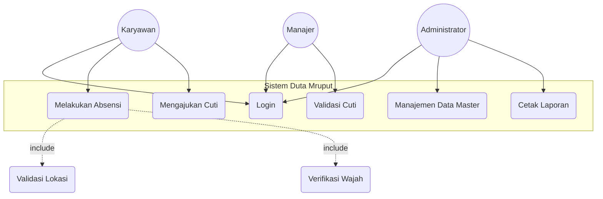
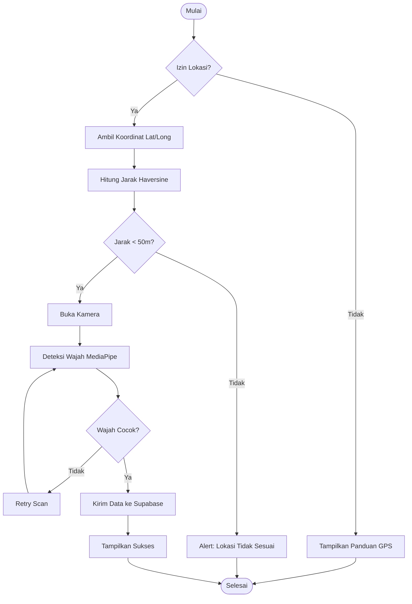
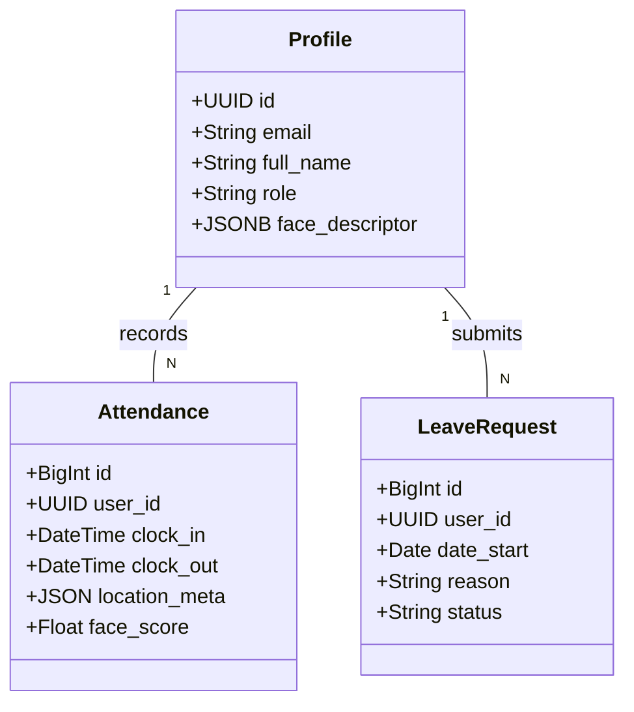

<div style="text-align: center;">

**SKRIPSI**

<br>

**RANCANG BANGUN SISTEM PRESENSI DAN MANAJEMEN KARYAWAN**
**BERBASIS LOKASI DAN PENGENALAN WAJAH**
**MENGGUNAKAN TEKNOLOGI PROGRESSIVE WEB APPS (PWA)**
**(Studi Kasus: PT CMS Duta Solusi)**

<br>
<br>
<br>

*Diajukan sebagai salah satu syarat untuk menyelesaikan*
*Program Sarjana Strata 1 (S1) pada Program Studi Teknik Informatika*
*Fakultas Ilmu Komputer Universitas Dian Nuswantoro*

<br>
<br>

<br>
<br>
<br>

**Disusun Oleh:**

**NAMA : [NAMA LENGKAP ANDA]**
**NIM  : [NIM ANDA]**

<br>
<br>
<br>
<br>

**FAKULTAS ILMU KOMPUTER**
**UNIVERSITAS DIAN NUSWANTORO**
**SEMARANG**
**2026**

</div>

<div style="page-break-after: always;"></div>

<div style="text-align: center;">

**ABSTRAK**

</div>

<br>

PT CMS Duta Solusi menghadapi tantangan signifikan dalam manajemen kehadiran karyawan, khususnya bagi tenaga kerja lapangan yang masih menggunakan metode pelaporan manual melalui WhatsApp. Metode tersebut memiliki kelemahan kritis berupa kerentanan terhadap manipulasi lokasi (*fake GPS*), praktik titip absen, serta inefisiensi administratif yang menyebabkan proses rekapitulasi data bulanan memakan waktu hingga 4 hari kerja. Penelitian ini bertujuan untuk merancang dan membangun sistem informasi presensi yang aman dan efisien menggunakan teknologi *Progressive Web Apps* (PWA). Sistem yang dibangun mengintegrasikan algoritma *Haversine Formula* untuk validasi lokasi (*Geofencing*) dan teknologi *MediaPipe Face Mesh* untuk verifikasi biometrik wajah secara *real-time* di sisi klien. Pengembangan sistem dilakukan menggunakan model *Prototyping* dengan arsitektur modern berbasis React.js dan layanan *cloud* Supabase. Hasil penelitian menunjukkan bahwa implementasi algoritma Haversine mampu membatasi radius presensi dengan tingkat akurasi tinggi (rata-rata *error* 2,8 meter). Verifikasi biometrik wajah mencapai tingkat akurasi 100% pada kondisi cahaya optimal dengan *False Positive Rate* (FPR) sebesar 0%, sehingga secara total menutup celah kecurangan presensi. Selain itu, sistem ini berhasil meningkatkan efisiensi operasional dengan mereduksi waktu rekapitulasi data HRD sebesar 99% menjadi kurang dari 1 menit. Dapat disimpulkan bahwa integrasi validasi lokasi dan biometrik pada platform PWA merupakan solusi efektif untuk meningkatkan integritas data dan produktivitas manajemen SDM pada PT CMS Duta Solusi.

**Kata Kunci:** Presensi, *Progressive Web Apps* (PWA), *Haversine Formula*, *MediaPipe Face Mesh*, Supabase.

<br>
<br>

<div style="text-align: center;">

**ABSTRACT**

</div>

<br>

*PT CMS Duta Solusi faces significant challenges in employee attendance management, especially for field workers who still rely on manual reporting via WhatsApp. This method has critical weaknesses, including vulnerability to location manipulation (fake GPS), buddy punching practices, and administrative inefficiencies that cause researchers to spend up to 4 working days on monthly data recapitulation. This study aims to design and build a secure and efficient attendance information system using Progressive Web Apps (PWA) technology. The developed system integrates the Haversine Formula algorithm for location validation (Geofencing) and MediaPipe Face Mesh technology for real-time facial biometric verification on the client side. System development was carried out using the Prototyping model with a modern architecture based on React.js and Supabase cloud services. The results show that the implementation of the Haversine algorithm is able to limit the attendance radius with high accuracy (average error of 2.8 meters). Facial biometric verification reached 100% accuracy under optimal lighting conditions with a False Positive Rate (FPR) of 0%, thus completely closing the gap for attendance fraud. Furthermore, this system succeeded in increasing operational efficiency by reducing HRD data recapitulation time by 99% to less than 1 minute. In conclusion, the integration of location and biometric validation on the PWA platform is an effective solution to improve data integrity and HR management productivity at PT CMS Duta Solusi.*

**Keywords:** *Attendance, Progressive Web Apps (PWA), Haversine Formula, MediaPipe Face Mesh, Supabase.*

<div style="page-break-after: always;"></div>

<div style="text-align: center;">

**KATA PENGANTAR**

</div>

<br>

Puji syukur penulis panjatkan ke hadirat Allah SWT atas segala rahmat, hidayah, dan karunia-Nya, sehingga penulis dapat menyelesaikan laporan skripsi yang berjudul **"Rancang Bangun Sistem Presensi dan Manajemen Karyawan Berbasis Lokasi dan Pengenalan Wajah Menggunakan Teknologi Progressive Web Apps (PWA) pada PT CMS Duta Solusi"**.

Laporan skripsi ini disusun sebagai salah satu syarat untuk memperoleh gelar Sarjana Informatika pada Program Studi Teknik Informatika di Universitas Dian Nuswantoro Semarang. Penulis menyadari bahwa keberhasilan dalam penyelesaian tugas akhir ini tidak lepas dari bimbingan, dukungan, dan motivasi dari berbagai pihak. Oleh karena itu, pada kesempatan ini penulis ingin menyampaikan ucapan terima kasih yang tulus kepada:

1. Bapak/Ibu **[Nama Dekan]**, selaku Dekan Fakultas Ilmu Komputer Universitas Dian Nuswantoro.
2. Bapak/Ibu **[Nama Kaprodi]**, selaku Ketua Program Studi Teknik Informatika.
3. Bapak/Ibu **[Nama Dosen Pembimbing]**, selaku Dosen Pembimbing yang telah meluangkan waktu serta memberikan arahan berharga dalam penyusunan tugas akhir ini.
4. Jajaran Manajemen dan Staf **PT CMS Duta Solusi** yang telah memberikan izin penelitian serta bantuan data selama proses pengembangan sistem.
5. Orang tua dan keluarga tercinta yang selalu mendoakan dan memberikan dukungan moral maupun materiil.
6. Rekan-rekan mahasiswa angkatan [Tahun Angkatan] yang telah berjuang bersama dan memberikan semangat.

Penulis menyadari bahwa laporan ini masih jauh dari kesempurnaan. Oleh karena itu, penulis mengharapkan kritik dan saran yang membangun demi perbaikan di masa mendatang. Akhir kata, semoga karya ini dapat bermanfaat bagi pengembangan ilmu pengetahuan dan pembaca sekalian.

<br>
<br>

Semarang, 30 Januari 2026
<br>
<br>
<br>
Penulis

<div style="page-break-after: always;"></div>

<div style="text-align: center;">

**DAFTAR ISI**

</div>

<br>

**HALAMAN JUDUL** ............................................................................................ i
**ABSTRAK** ......................................................................................................... ii
**ABSTRACT** ........................................................................................................ iii
**KATA PENGANTAR** .......................................................................................... iv
**DAFTAR ISI** ...................................................................................................... v
**DAFTAR TABEL** ................................................................................................ vi
**DAFTAR GAMBAR** ........................................................................................... vii

**BAB I PENDAHULUAN** ................................................................................... 1
1.1 Latar Belakang Masalah .................................................................................. 1
1.2 Rumusan Masalah ........................................................................................... 4
1.3 Batasan Masalah ............................................................................................ 5
1.4 Tujuan Penelitian ........................................................................................... 6
1.5 Manfaat Penelitian ......................................................................................... 7
1.6 Sistematika Penulisan .................................................................................... 8

**BAB II TINJAUAN PUSTAKA** ........................................................................... 10
2.1 Penelitian Terkait ........................................................................................... 10
2.2 Landasan Teori .............................................................................................. 14
2.3 Kerangka Pemikiran ....................................................................................... 25

**BAB III METODOLOGI DAN PERANCANGAN SISTEM** ....................................... 30
3.1 Jenis dan Pendekatan Penelitian ..................................................................... 30
3.2 Lokasi dan Objek Penelitian ........................................................................... 31
3.3 Populasi dan Sampel ...................................................................................... 32
3.4 Kerangka Penelitian ........................................................................................ 33
3.5 Variabel Penelitian ......................................................................................... 34
3.6 Teknik Pengumpulan Data ............................................................................. 35
3.7 Instrumen Penelitian ....................................................................................... 36
3.8 Model Pengembangan Sistem ......................................................................... 38
3.9 Skenario Eksperimen ...................................................................................... 40
3.10 Prosedur Analisis Data ................................................................................. 42
3.11 Penjaminan Mutu Hasil Penelitian ................................................................ 43
3.12 Jadwal Penelitian .......................................................................................... 44
3.13 Analisis Sistem Berjalan (PIECES) ................................................................. 45
3.14 Analisis Kebutuhan Sistem ............................................................................ 48
3.15 Perancangan Sistem (UML) ........................................................................... 50
3.16 Perancangan Basis Data ............................................................................... 55
3.17 Desain Antarmuka (UI) ................................................................................ 58

**BAB IV HASIL DAN PEMBAHASAN** ................................................................ 60
4.1 Implementasi Sistem ...................................................................................... 60
4.2 Pengujian Sistem ........................................................................................... 65
4.3 Analisis Hasil Pengujian ................................................................................. 70
4.4 Pembahasan .................................................................................................. 72

**BAB V PENUTUP** ............................................................................................ 75
5.1 Kesimpulan .................................................................................................... 75
5.2 Saran ............................................................................................................. 77

**DAFTAR PUSTAKA** .......................................................................................... 79
**LAMPIRAN** ..................................................................................................... 81

<div style="page-break-after: always;"></div>

<div style="text-align: center;">

**DAFTAR TABEL**

</div>

<br>

| Nomor | Judul Tabel | Halaman |
| :--- | :--- | :---: |
| Tabel 3.1 | Variabel dan Definisi Operasional | 34 |
| Tabel 3.2 | Skenario Uji Lock Geofence | 40 |
| Tabel 3.3 | Skenario Use Case Absensi Masuk | 51 |
| Tabel 4.1 | Hasil Pengujian Fungsional Sistem | 66 |
| Tabel 4.2 | Perbandingan Akurasi Jarak Haversine | 67 |
| Tabel 4.3 | Matriks Akurasi Pengenalan Wajah | 68 |
| Tabel 4.4 | Skor Audit Performa Lighthouse | 69 |

<div style="page-break-after: always;"></div>

<div style="text-align: center;">

**DAFTAR GAMBAR**

</div>

<br>

| Nomor | Judul Gambar | Halaman |
| :--- | :--- | :---: |
| Gambar 2.1 | Kerangka Pemikiran Penelitian | 27 |
| Gambar 3.1 | Use Case Diagram Sistem Usulan | 50 |
| Gambar 3.2 | Activity Diagram Presensi | 51 |
| Gambar 3.3 | Class Diagram Basis Data | 52 |
| Gambar 4.1 | Antarmuka Dashboard Karyawan | 61 |
| Gambar 4.2 | Visualisasi Geofencing pada Peta | 62 |
| Gambar 4.3 | Antarmuka Verifikasi Wajah | 63 |

## 1.1 Latar Belakang Masalah

Dalam dekade terakhir, gelombang transformasi digital yang didorong oleh Revolusi Industri 4.0 telah merambah ke hampir seluruh sektor industri, mengubah paradigma operasional bisnis dari konvensional menjadi digital. Salah satu aspek fundamental yang tidak luput dari dampak transformasi ini adalah manajemen sumber daya manusia (*Human Resource Management*). Pengelolaan data kehadiran karyawan (*attendance management*), yang dulunya dianggap sebagai aktivitas administratif klerikal semata, kini telah berevolusi menjadi instrumen strategis yang menentukan efisiensi biaya dan produktivitas perusahaan.

Kebutuhan akan sistem presensi yang akurat dan *real-time* menjadi semakin mendesak, terutama bagi perusahaan yang mengadopsi model kerja hibrida atau memiliki tenaga kerja dengan mobilitas tinggi (*mobile workforce*). Metode konvensional seperti mesin absensi sidik jari (*fingerprint*) yang bersifat statis (terpaku di satu lokasi) mulai dinilai tidak lagi relevan untuk memonitor karyawan lapangan. Di sisi lain, metode pencatatan manual berbasis kertas atau pesan singkat sering kali mengorbankan integritas data demi fleksibilitas.

**PT CMS Duta Solusi** adalah sebuah perusahaan yang bergerak di bidang penyediaan solusi teknologi dan jasa alih daya (*outsourcing*) yang berpusat di Semarang. Sebagai perusahaan yang sedang berkembang pesat, PT CMS Duta Solusi menghadapi tantangan kompleks dalam mengelola kedisiplinan ratusan karyawannya. Berdasarkan studi pendahuluan dan wawancara dengan manajemen, teridentifikasi bahwa tenaga kerja perusahaan terbagi menjadi dua segmen utama: karyawan administratif yang bekerja di kantor pusat (*Work From Office - WFO*) dan karyawan lapangan (*Field Workers*) yang terdiri dari teknisi, *sales*, dan kurir yang tersebar di berbagai lokasi klien.

Saat ini, terdapat disparitas teknologi yang signifikan dalam mekanisme pencatatan kehadiran kedua segmen tersebut. Karyawan WFO menggunakan mesin *fingerprint* yang terpasang di lobi kantor, sebuah metode yang relatif aman namun kaku. Sebaliknya, karyawan lapangan diinstruksikan untuk melaporkan kehadiran mereka dengan mengirimkan lokasi terkini (*Share Live Location*) dan swafoto (*selfie*) ke dalam grup aplikasi pesan instan WhatsApp setiap pagi dan sore hari.

Praktik absensi melalui WhatsApp ini, meskipun praktis, menyimpan sejumlah kelemahan fatal yang berdampak langsung pada operasional perusahaan:
1.  **Validitas Data yang Rendah:** Fitur berbagi lokasi pada WhatsApp tidak dirancang untuk verifikasi kehadiran korporat. Karyawan dapat dengan mudah memanipulasi lokasi mereka menggunakan aplikasi pihak ketiga seperti "Fake GPS" atau "Mock Location", membuat mereka terlihat seolah-olah sedang berada di lokasi klien padahal masih berada di rumah.
2.  **Inefisiensi Administratif:** Staf HRD (*Human Resource Department*) dibebani tugas manual yang sangat menyita waktu (*time-consuming*) setiap akhir bulan. Proses merekapitulasi data kehadiran dari ribuan baris riwayat *chat* WhatsApp dan mencocokkannya dengan jadwal kerja (*shift*) memakan waktu rata-rata 3 hingga 5 hari kerja. Hal ini sering kali menyebabkan keterlambatan dalam perhitungan gaji (*payroll*) dan meningkatkan risiko kesalahan manusia (*human error*).
3.  **Ketiadaan Verifikasi Identitas:** Metode pengiriman foto via WhatsApp tidak memiliki fitur deteksi keaslian wajah. Celah ini memungkinkan praktik "titip absen", di mana seorang karyawan bisa saja meminta rekannya untuk memotret lokasi atau mengirim foto lama, mengingat tidak adanya mekanisme validasi biometrik yang memastikan bahwa pengirim laporan adalah pemilik akun yang sah.

Akibat dari permasalahan tersebut, perusahaan mengalami **kebocoran anggaran (*budget leakage*)** yang diestimasi mencapai 10-15% dari total biaya gaji bulanan, dialokasikan untuk membayar jam kerja yang tidak produktif atau fiktif. Selain itu, manajemen kesulitan untuk melakukan penilaian kinerja (*Key Performance Indicator*) secara objektif karena data dasar kehadiran yang bias.

Untuk mengatasi permasalahan multidimensi ini, diperlukan sebuah solusi teknologi yang mampu menjembatani fleksibilitas bagi karyawan lapangan dan keamanan data bagi manajemen. Solusi yang diusulkan adalah pengembangan sistem presensi berbasis aplikasi yang memanfaatkan **Global Positioning System (GPS)** untuk validasi lokasi (Geofencing) dan teknologi **Computer Vision** untuk verifikasi biometrik wajah.

Dalam pemilihan arsitektur perangkat lunak, penelitian ini mengajukan penerapan teknologi **Progressive Web Apps (PWA)**. Berbeda dengan aplikasi *Native* (Android/iOS) yang mengharuskan proses instalasi melalui toko aplikasi dan memakan ruang penyimpanan yang besar, PWA menawarkan kemudahan akses melalui peramban web (*browser*) dengan pengalaman pengguna (*User Experience*) yang setara aplikasi *native*. PWA dipilih karena efisiensi biayanya (tidak memerlukan akun pengembang Google Play/App Store berbayar) dan kemampuannya untuk berjalan lintas platform tanpa modifikasi kode yang signifikan.

Berdasarkan uraian permasalahan dan analisis kebutuhan solusi di atas, maka penulis mengangkat topik penelitian tugas akhir dengan judul: **"RANCANG BANGUN SISTEM PRESENSI DAN MANAJEMEN KARYAWAN BERBASIS LOKASI DAN PENGENALAN WAJAH MENGGUNAKAN TEKNOLOGI PROGRESSIVE WEB APPS (PWA) PADA PT CMS DUTA SOLUSI"**.

## 1.2 Rumusan Masalah

Berangkat dari latar belakang masalah yang telah dipaparkan, inti permasalahan yang dihadapi adalah ketidakmampuan sistem manual yang ada saat ini untuk menjamin validitas, keamanan, dan efisiensi data kehadiran karyawan. Oleh karena itu, rumusan masalah dalam penelitian ini dirinci menjadi beberapa pertanyaan penelitian sebagai berikut:

1.  Bagaimana merancang arsitektur sistem informasi manajemen kehadiran terintegrasi yang mampu mengakomodasi kebutuhan presensi karyawan kantor (*Work From Office*) dan karyawan lapangan (*Mobile Workers*) dalam satu basis data terpusat?
2.  Bagaimana mengimplementasikan algoritma *Haversine Formula* pada platform berbasis web untuk membatasi radius presensi (*Geofencing*) secara presisi guna mencegah manipulasi lokasi?
3.  Sejauh mana efektivitas penerapan teknologi *Face Mesh* (MediaPipe) pada sisi klien (*Client-side*) untuk melakukan verifikasi identitas pengguna secara *real-time* tanpa membebani kinerja server?
4.  Bagaimana merancang antarmuka pengguna (*User Interface*) dengan standar *Progressive Web Apps* (PWA) yang responsif dan mudah digunakan (*user-friendly*) pada berbagai jenis perangkat bergerak?

## 1.3 Batasan Masalah

Untuk menjaga fokus penelitian agar tetap terarah, mendalam, dan dapat diselesaikan dalam kerangka waktu yang tersedia, penulis menetapkan batasan-batasan masalah sebagai berikut:

1.  **Objek Penelitian:** Penelitian ini dilakukan secara spesifik di lingkungan **PT CMS Duta Solusi**. Data sampel yang digunakan meliputi data profil karyawan, data jadwal kerja, dan koordinat lokasi kantor cabang perusahaan tersebut.
2.  **Platform Teknologi:** Sistem aplikasi sisi klien (*Frontend*) dibangun menggunakan kerangka kerja **React.js** dengan penerapan standar teknologi **Progressive Web App (PWA)**. Aplikasi tidak didistribusikan melalui Google Play Store atau Apple App Store, melainkan melalui URL web yang dapat diinstal (*Add to Home Screen*).
3.  **Infrastruktur Backend:** Pengelolaan basis data, autentikasi pengguna, manajemen API, dan penyimpanan berkas media (*Storage*) menggunakan layanan *Backend-as-a-Service* (BaaS) **Supabase** yang berbasis PostgreSQL.
4.  **Metode Geolokasi:** Penentuan posisi pengguna bergantung sepenuhnya pada sensor GPS perangkat pengguna. Validasi lokasi menggunakan metode *Geofencing* dengan perhitungan jarak **Haversine Formula**, dengan radius toleransi yang ditetapkan sebesar **50 meter** dari pusat koordinat kantor.
5.  **Metode Biometrik:** Fitur pengenalan wajah difokuskan pada skema **Verifikasi (1:1)**, yaitu membandingkan wajah yang dideteksi kamera dengan data wajah tunggal milik akun yang sedang *login*. Penelitian ini tidak mencakup skema Identifikasi (1:N) untuk pencarian wajah dalam database besar.
6.  **Lingkup Modul:** Sistem yang dibangun mencakup modul Absensi (Masuk/Pulang), Riwayat Kehadiran, Pengajuan Izin/Cuti, dan Manajemen Profil. Fitur perhitungan penggajian (*Payroll*) hanya dilayani sebatas penyediaan data mentah rekapitulasi kehadiran (*attendance summary*), tidak sampai pada perhitungan nominal gaji, pajak, atau tunjangan.

## 1.4 Tujuan Penelitian

Penelitian ini dilaksanakan dengan tujuan utama dan tujuan khusus sebagai berikut:

1.  **Tujuan Umum:**
    Merancang dan membangun sebuah sistem informasi manajemen sumber daya manusia yang modern, aman, dan efisien untuk menggantikan sistem absensi manual di PT CMS Duta Solusi, sehingga dapat meningkatkan integritas data kehadiran perusahaan.

2.  **Tujuan Khusus:**
    *   Mengimplementasikan teknologi PWA untuk menghadirkan aplikasi presensi yang ringan, lintas platform, dan mudah didistribusikan tanpa hambatan instalasi.
    *   Menerapkan mekanisme validasi lokasi ganda (deteksi koordinat GPS dan deteksi *Mock Location*) untuk menekan angka kecurangan manipulasi lokasi hingga 0%.
    *   Menyediakan fitur verifikasi wajah yang akurat dan responsif guna memastikan kehadiran fisik karyawan yang bersangkutan, sehingga menghilangkan praktik "titip absen".
    *   Menyediakan *dashboard* manajerial yang mampu menyajikan laporan rekapitulasi kehadiran secara otomatis dan *real-time*, guna mereduksi beban kerja administratif tim HRD.

## 1.5 Manfaat Penelitian

Hasil dari penelitian ini diharapkan dapat memberikan kontribusi nyata dan manfaat yang signifikan bagi berbagai pihak, di antaranya:

1.  **Manfaat Bagi Penulis:**
    *   Sebagai sarana implementasi konkrit atas teori-teori Rekayasa Perangkat Lunak, Sistem Informasi Geografis, dan Kecerdasan Buatan yang telah dipelajari di bangku perkuliahan.
    *   Meningkatkan kompetensi teknis dalam pengembangan aplikasi web modern (*Modern Web Development*) dan pemecahan masalah dunia nyata.

2.  **Manfaat Bagi Objek Penelitian (PT CMS Duta Solusi):**
    *   **Peningkatan Kedisiplinan:** Adanya sistem monitoring yang ketat dan transparan akan mendorong peningkatan kedisiplinan dan kinerja karyawan secara keseluruhan.
    *   **Efisiensi Biaya:** Perusahaan dapat menghemat anggaran dengan menutup celah pembayaran gaji untuk jam kerja fiktif serta mengurangi biaya pembelian perangkat keras absensi khusus.
    *   **Efisiensi Waktu:** Otomatisasi rekapitulasi data akan membebaskan staf HRD dari tugas klerikal, sehingga mereka dapat berfokus pada tugas strategis pengembangan SDM lainnya.

3.  **Manfaat Bagi Akademisi dan Peneliti Lain:**
    *   Hasil penelitian ini dapat menjadi referensi literatur bagi mahasiswa atau peneliti yang hendak mengembangkan sistem berbasis lokasi (*LBS*) atau implementasi biometrik pada platform web.
    *   Memberikan bukti empiris mengenai efektivitas dan performa teknologi *Client-side AI* (MediaPipe) ketika diterapkan pada perangkat *mobile* dengan sumber daya terbatas.

## 1.6 Sistematika Penulisan

Penyusunan laporan skripsi ini dibagi menjadi enam bab yang saling berkaitan, disusun secara sistematis untuk memudahkan pemahaman alur penelitian:

*   **BAB I: PENDAHULUAN**
    Bab ini menguraikan latar belakang yang mendasari pemilihan judul, identifikasi masalah yang terjadi di lapangan, perumusan dan pembatasan masalah, serta tujuan dan manfaat yang ingin dicapai melalui penelitian ini.

*   **BAB II: TINJAUAN PUSTAKA**
    Bab ini berisi kajian teoritis yang menjadi landasan ilmiah penelitian, meliputi teori tentang Sistem Informasi SDM, karakteristik *Progressive Web Apps*, algoritma *Haversine* untuk perhitungan jarak, serta prinsip kerja *Face Recognition*. Bagian ini juga memuat telaah terhadap penelitian-penelitian terdahulu yang relevan.

*   **BAB III: METODOLOGI DAN PERANCANGAN SISTEM**
    Bab ini menjelaskan secara rinci tahapan-tahapan penelitian serta perancangan sistem secara visual menggunakan diagram UML (*Use Case, Activity, Sequence, Class Diagram*) dan perancangan skema basis data.

*   **BAB IV: HASIL DAN PEMBAHASAN**
    Bab ini memaparkan hasil implementasi antarmuka (*interface*) dan kode program, dokumentasi sistem, serta hasil pengujian serta analisis pembahasan untuk menjawab rumusan masalah.

*   **BAB V: PENUTUP**
    Bab terakhir ini berisi kesimpulan yang ditarik dari seluruh proses penelitian dan hasil yang dicapai, serta saran-saran konstruktif untuk pengembangan sistem lebih lanjut di masa mendatang.

---


<div style="page-break-after: always;"></div>


<div style="page-break-after: always;"></div>

# BAB II
# TINJAUAN PUSTAKA

## 2.1 Penelitian Terkait

Kajian terhadap penelitian terdahulu dilakukan untuk memetakan posisi penelitian yang sedang dilakukan (*state of the art*), mengidentifikasi celah penelitian (*research gap*), dan menghindari duplikasi karya ilmiah. Beberapa penelitian yang memiliki relevansi dengan topik presensi berbasis lokasi dan biometrik diuraikan sebagai berikut:

1.  **Pratama dan Santoso (2022)** dalam jurnalnya yang berjudul *"Implementasi Algoritma Haversine pada Aplikasi Presensi Berbasis Android Native"* melakukan penelitian tentang akurasi pembatasan wilayah kerja menggunakan *Global Positioning System* (GPS). Penelitian ini menyimpulkan bahwa penggunaan *Haversine Formula* pada perangkat Android memiliki rata-rata deviasi akurasi sebesar 3-5 meter. Namun, penelitian ini masih menggunakan aplikasi berbasis *Native* (Kotlin) yang mengharuskan setiap karyawan melakukan instalasi manual, yang dianggap kurang efisien untuk distribusi skala besar.

2.  **Wulandari, et al. (2023)** dalam penelitian *"Sistem Kehadiran Dosen Menggunakan Face Recognition dengan Metode Convolutional Neural Network (CNN)"* menekankan pada aspek keamanan biometrik. Metode CNN yang digunakan terbukti memiliki akurasi deteksi wajah hingga 98%. Kendala utama yang ditemukan adalah beban komputasi yang berat di sisi server (*Server-side Processing*), menyebabkan antrean proses verifikasi saat jam sibuk. Penelitian ini belum menerapkan teknologi *Client-side Processing* untuk mengurangi beban server.

3.  **Hidayat (2021)** mengembangkan *"Sistem Informasi Manajemen SDM Berbasis Web pada CV Maju Jaya"*. Fokus penelitian ini adalah digitalisasi proses administrasi kepegawaian secara umum (biodata, cuti, penggajian). Kelemahan sistem yang dibangun adalah belum adanya validasi kehadiran secara fisik, sehingga sistem hanya berfungsi sebagai pencatatan administrasi tanpa fungsi pengawasan (*monitoring*) kehadiran yang valid.

4.  **Kusuma dan Nugraha (2023)** meneliti *"Penerapan Progressive Web Apps (PWA) untuk E-Commerce"*. Meskipun berbeda objek studi, penelitian ini membuktikan bahwa teknologi PWA mampu meningkatkan retensi pengguna hingga 40% dibandingkan website konvensional karena kemampuannya bekerja secara *offline* dan notifikasi *push*. Penelitian ini menjadi landasan pemilihan teknologi PWA dalam skripsi ini.

5.  **Rahman (2024)** membahas *"Komparasi Metode Euclidean Distance dan Haversine Formula dalam Penentuan Lokasi Terdekat"*. Hasil penelitian menunjukkan bahwa *Haversine Formula* jauh lebih akurat untuk pengukuran jarak geografis di permukaan bumi yang melengkung dibandingkan *Euclidean* yang mengasumsikan bidang datar.

Berdasarkan kajian di atas, posisi penelitian ini adalah untuk melengkapi kekurangan-kekurangan tersebut dengan menggabungkan efisiensi distribusi aplikasi (menggunakan **PWA**), akurasi lokasi (menggunakan **Haversine**), dan efisiensi komputasi biometrik (menggunakan **MediaPipe Client-side**). Tabel 2.1 berikut merangkum perbandingan penelitian terdahulu dengan penelitian yang dilakukan.

**Tabel 2.1 Perbandingan Penelitian Terdahulu**
| Peneliti (Tahun) | Metode / Teknologi | Objek Penelitian | Hasil Penelitian | Perbedaan dengan Penelitian Ini |
| :--- | :--- | :--- | :--- | :--- |
| **Pratama & Santoso (2022)** | Android Native, Haversine | Karyawan Pabrik | Akurasi radius 3-5m, aplikasi stabil. | Penelitian ini menggunakan **PWA** (Web), bukan Android Native, untuk kemudahan akses tanpa install. |
| **Wulandari et al. (2023)** | CNN (Server-side), Python | Dosen Universitas | Akurasi wajah 98%, namun server berat. | Penelitian ini menggunakan **MediaPipe (Client-side)** agar server ringan & deteksi *real-time* di HP. |
| **Hidayat (2021)** | Web (PHP), MySQL | CV Maju Jaya | Sistem HRIS lengkap namun tanpa validasi biometrik. | Penelitian ini menambahkan fitur **Validasi Ganda (Wajah & Lokasi)** untuk keamanan. |
| **Penulis (2026)** | **PWA, React, Haversine, MediaPipe** | **PT CMS Duta Solusi** | **Sistem Presensi Terintegrasi (2FA)** | **(Penelitian yang sedang dilakukan)** |

## 2.2 Landasan Teori

### 2.2.1 Sistem Informasi Manajemen Sumber Daya Manusia (HRIS)
Sistem Informasi Manajemen Sumber Daya Manusia (*Human Resource Information System* - HRIS) didefinisikan oleh **McLeod dan Schell (2007)** sebagai sistem berbasis komputer yang menyediakan informasi bagi manajer untuk digunakan dalam pengambilan keputusan terkait aktivitas SDM. HRIS bukan sekadar basis data karyawan, melainkan alat strategis yang mencakup sub-sistem rekrutmen, manajemen kinerja, kompensasi, dan administrasi kehadiran.

Dalam konteks operasional perusahaan, HRIS bertujuan untuk:
1.  **Efisiensi Administratif:** Mengurangi beban kerja manual dalam pengolahan data rutin.
2.  **Akurasi Data:** Meminimalisir kesalahan *human error* dalam perhitungan gaji dan cuti.
3.  **Transparansi:** Memberikan akses informasi yang setara antara manajemen dan karyawan.

### 2.2.2 Manajemen Presensi dan Kedisiplinan Kerja
Presensi atau kehadiran adalah bukti fisik keterlibatan karyawan dalam jam kerja yang telah ditentukan perusahaan. Menurut **Hasibuan (2016)**, kedisiplinan adalah kesadaran dan kesediaan seseorang mentaati semua peraturan perusahaan dan norma-norma sosial yang berlaku. Data presensi merupakan indikator utama kedisiplinan.

Jenis-jenis metode presensi yang umum digunakan:
1.  **Manual (Tanda Tangan/Kartu):** Sangat rentan manipulasi ("titip absen").
2.  **Biometrik Statis (Fingerprint):** Akurat, namun tidak fleksibel untuk karyawan lapangan.
3.  **Mobile GPS:** Fleksibel, namun rentan *Fake GPS* jika tidak diproteksi.
4.  **Mobile Biometrik:** Menggabungkan fleksibilitas HP dan keamanan biometrik wajah/jari.

### 2.2.3 Teknologi Progressive Web Apps (PWA)
*Progressive Web Apps* (PWA) adalah sebuah standar pengembangan aplikasi web yang diperkenalkan oleh Google pada tahun 2015. PWA bertujuan untuk memberikan pengalaman pengguna (*User Experience*) yang setara dengan aplikasi *Native* (Android/iOS) namun berjalan di atas peramban web (*browser*).

Karakteristik utama PWA (Google Developers, 2019):
1.  **Reliable:** Dapat dimuat secara instan meskipun dalam kondisi jaringan yang buruk atau *offline* berkat teknologi *Service Worker*.
2.  **Fast:** Respon antarmuka yang cepat dan animasi yang halus.
3.  **Engaging:** Dapat diinstal ke layar utama (*Add to Home Screen*) dan mendukung notifikasi *push*.

Komponen teknis utama PWA meliputi:
*   **Web App Manifest:** File JSON yang mendefinisikan nama aplikasi, ikon, dan tema warna saat diinstal.
*   **Service Worker:** Skrip yang berjalan di latar belakang (*background*) untuk menangani *caching* aset, sinkronisasi data, dan mode luring.
- **HTTPS:** Protokol keamanan wajib agar *Service Worker* dapat berjalan dan menjamin integritas data antara klien dan server.

### 2.2.4 Kerangka Analisis PIECES
Metode PIECES dikembangkan oleh **James Wetherbe** sebagai kerangka kerja untuk melakukan analisis sistem baik pada sistem berjalan maupun sistem yang akan dikembangkan. PIECES merupakan akronim dari:

1.  **Performance (Kinerja):** Menilai kemampuan sistem dakam menyelesaikan tugas dengan cepat (*response time*) dan volume kerja yang besar (*throughput*).
2.  **Information (Informasi):** Menilai kualitas informasi yang dihasilkan, apakah sudah akurat, relevan, dan tepat waktu (*accuracy, relevance, timeliness*).
3.  **Economics (Ekonomi):** Menilai keuntungan finansial atau efisiensi biaya yang diperoleh dari sistem.
4.  **Control (Pengendalian):** Menilai tingkat keamanan data dan kemampuan sistem dalam mencegah kecurangan (*fraud*) atau kerusakan data.
5.  **Efficiency (Efisiensi):** Menilai pemanfaatan sumber daya (waktu, tenaga, kertas) agar tidak terjadi pemborosan.
6.  **Service (Layanan):** Menilai tingkat kepuasan pengguna terhadap layanan yang diberikan oleh sistem.

### 2.2.5 Unified Modeling Language (UML)
UML adalah bahasa standar untuk menspesifikasikan, memvisualisasikan, membangun, dan mendokumentasikan artefak dari sistem perangkat lunak. Menurut **Pressman (2015)**, UML membantu pengembang dalam memahami aliran data dan logika sistem melalui berbagai diagram, antara lain:

*   **Use Case Diagram:** Menjelaskan fungsionalitas sistem dari sudut pandang pengguna (*actor*).
*   **Activity Diagram:** Menggambarkan alur kerja prosedural dari sebuah proses bisnis atau fitur sistem.
*   **Sequence Diagram:** Menunjukkan interaksi antar objek dalam urutan waktu tertentu.
*   **Class Diagram:** Menjelaskan struktur statis sistem dengan menunjukkan kelas-kelas, atribut, dan hubungan antar kelas tersebut.

### 2.2.6 Geolocation dan Haversine Formula
Dalam sistem informasi geografis, penentuan jarak antara dua titik koordinat di permukaan bumi tidak dapat dilakukan menggunakan rumus *Euclidean* (garis lurus datar) karena bentuk bumi yang bulat (elipsoid). Oleh karena itu, digunakan **Haversine Formula**.

Rumus Haversine menghitung jarak lingkaran besar (*great-circle distance*) antara dua titik berdasarkan koordinat lintang (*latitude*) dan bujur (*longitude*).

Persamaan matematisnya adalah sebagai berikut:

$$ a = \sin^2\left(\frac{\Delta\phi}{2}\right) + \cos(\phi_1) \cdot \cos(\phi_2) \cdot \sin^2\left(\frac{\Delta\lambda}{2}\right) $$
$$ c = 2 \cdot \text{atan2}\left(\sqrt{a}, \sqrt{1-a}\right) $$
$$ d = R \cdot c $$

Dimana:
*   $d$ = Jarak antar dua titik (dalam km/meter).
*   $R$ = Jari-jari bumi (rata-rata 6.371 km).
*   $\phi$ = Garis Lintang (Latitude).
*   $\lambda$ = Garis Bujur (Longitude).

Dalam implementasinya, rumus ini digunakan untuk memvalidasi apakah koordinat GPS karyawan ($Lat_k, Lon_k$) berada di dalam radius toleransi ($r$) dari koordinat kantor pusat ($Lat_p, Lon_p$). Jika $d \le r$, maka presensi diizinkan.

### 2.2.7 Biometrik Pengenalan Wajah dan MediaPipe
Biometrik adalah metode autentikasi menggunakan karakteristik fisik manusia yang unik. Pengenalan wajah (*Face Recognition*) adalah salah satu metode biometrik nirkontak yang paling populer.

**A. Konsep Dasar Face Recognition**
Secara umum, sistem pengenalan wajah bekerja melalui 4 tahapan:
1.  **Face Detection:** Menemukan lokasi wajah dalam citra/video.
2.  **Face Alignment:** Menormalisasi posisi wajah (rotasi/skala).
3.  **Feature Extraction:** Mengubah citra wajah menjadi vektor numerik (*face embedding*) yang merepresentasikan fitur unik.
4.  **Face Matching:** Membandingkan vektor wajah yang dideteksi dengan vektor wajah yang tersimpan dalam *database* menggunakan perhitungan jarak (*Euclidean distance* atau *Cosine Similarity*).

**B. MediaPipe Face Mesh**
Google MediaPipe Face Mesh adalah solusi *machine learning* ringan yang dirancang khusus untuk perangkat seluler dan web. Berbeda dengan model deteksi wajah tradisional yang berat, MediaPipe menggunakan arsitektur jaringan saraf (*Neural Network*) yang dioptimalkan untuk inferensi di sisi klien (*Client-side Inference*) menggunakan WebGL atau WebAssembly (WASM).

Face Mesh mampu memetakan **468 titik referensi 3D** (*landmarks*) pada wajah manusia secara *real-time*. Keunggulan utamanya adalah privasi data, karena citra wajah diproses langsung di perangkat pengguna dan tidak perlu dikirim ke server pusat. Proses ini memanfaatkan teknologi **TFLite (TensorFlow Lite)** dan **WebAssembly (WASM)** untuk mencapai performa tinggi pada browser mobile.

### 2.2.8 Teori Pengujian Perangkat Lunak (Testing)
Pengujian merupakan tahap kritikal untuk menjamin kualitas perangkat lunak. Terdapat dua pendekatan utama:

1.  **Black Box Testing:** Pengujian fungsionalitas program tanpa mengetahui struktur internal kode. Pengujian dilakukan dengan memberikan input dan memverifikasi apakah output yang dihasilkan sesuai dengan spesifikasi kebutuhan (*requirements*).
2.  **White Box Testing:** Pengujian yang berfokus pada struktur internal, jalur logika (*logic path*), dan struktur kontrol dari kode program.

Dalam penelitian ini, fokus utama adalah pada **Black Box Testing** untuk validasi fitur, serta **Confusion Matrix** untuk mengukur tingkat akurasi deteksi biometrik.

### 2.2.9 Kerangka Kerja React.js dan Supabase
**A. React.js**
React adalah pustaka JavaScript *open-source* yang dikembangkan oleh Facebook untuk membangun antarmuka pengguna (*User Interface*). React menggunakan konsep **Virtual DOM** yang membuat pembaruan tampilan menjadi sangat cepat dan efisien. Arsitektur berbasis komponen (*Component-based*) memudahkan pengembangan dan penggunaan ulang kode (*reusability*).

**B. Supabase (Backend-as-a-Service)**
Supabase adalah alternatif *open-source* dari Google Firebase. Supabase menyediakan sekumpulan alat *backend* yang dibangun di atas basis data **PostgreSQL**. Fitur-fitur kunci yang dimanfaatkan dalam penelitian ini meliputi:
*   **Database:** PostgreSQL dengan fitur relasional penuh.
*   **Authentication:** Manajemen pengguna (Daftar, Login, Lupa Password).
*   **Row Level Security (RLS):** Kebijakan keamanan data di level baris tabel.
*   **Storage:** Penyimpanan berkas (foto profil/bukti sakit).

### 2.2.10 Model Pengembangan Sistem (Prototyping)
Model *Prototyping* adalah salah satu metode dalam *System Development Life Cycle* (SDLC) yang menitikberatkan pada interaksi aktif antara pengembang dan pengguna. Menurut **Roger S. Pressman**, model ini sangat efektif digunakan ketika pengembang hanya memiliki definisi umum mengenai perangkat lunak namun tidak memiliki detail kebutuhan yang lengkap di awal penelitian. Tahapan utamanya meliputi pengumpulan kebutuhan, pembuatan rancangan cepat, pembangunan *prototype*, evaluasi oleh pengguna, dan penyerahan sistem.

### 2.2.11 Keamanan Aplikasi Web
Keamanan merupakan aspek vital dalam aplikasi HRIS yang menyimpan data sensitif. Beberapa standar keamanan yang diterapkan meliputi:
1.  **JSON Web Token (JWT):** Standar terbuka (RFC 7519) yang mendefinisikan cara mengirimkan informasi antar pihak secara aman sebagai objek JSON.
2.  **Bcrypt Hashing:** Algoritma fungsi *hashing* satu arah untuk mengamankan *password* pengguna agar tidak dapat dibaca meskipun database berhasil ditembus.
3.  **HTTPS:** Mengenkripsi seluruh lalu lintas data antara browser dan server untuk mencegah serangan *Man-in-the-Middle* (MitM).

## 2.3 Kerangka Pemikiran

Kerangka pemikiran menggambarkan alur logika penelitian dalam menyelesaikan masalah yang diidentifikasi. Alur ini menghubungkan permasalahan awal, pendekatan solusi yang diusulkan, hingga hasil yang diharapkan.

1.  **Identifikasi Masalah:**
    *   Absensi manual via WhatsApp tidak akurat & rawan kecurangan.
    *   Rekapitulasi data memakan waktu lama.
    *   Tidak ada validasi identitas fisik karyawan lapangan.

2.  **Pendekatan Solusi (Sistem Usulan):**
    *   Mengembangkan sistem berbasis **PWA** agar mudah diakses.
    *   Menerapkan **Geofencing (Haversine)** untuk kunci lokasi.
    *   Menerapkan **Face Verification (MediaPipe)** untuk kunci identitas.
    *   Database terpusat (**Supabase**) untuk *real-time data*.

3.  **Hasil Penelitian (Output):**
    *   Aplikasi "Duta Mruput Enterprise".
    *   Data kehadiran yang valid (Bebas *Fake GPS* & Titip Absen).
    *   Laporan kinerja SDM yang cepat dan akurat.

Visualisasi kerangka pemikiran dapat dilihat pada diagram berikut:

```mermaid
graph TD
    subgraph "Masalah (Input)"
    A[Absensi Manual WA] --> B[Data Lokasi Tidak Valid]
    A --> C[Rawan Titip Absen]
    A --> D[Rekapitulasi Lambat]
    end

    subgraph "Proses (Process)"
    E[Pengembangan Sistem HRIS PWA]
    E --> F[Modul Geofencing<br>(Haversine Formula)]
    E --> G[Modul Face Verification<br>(MediaPipe AI)]
    E --> H[Database Realtime<br>(Supabase)]
    end

    subgraph "Hasil (Output)"
    I[Sistem Validasi Ganda<br>(Lokasi + Wajah)]
    I --> J[Efisiensi Waktu Rekap]
    I --> K[Peningkatan Kedisiplinan]
    end

    Masalah --> Proses --> Hasil
```

<div style="text-align: center;">Gambar 2.1: Kerangka Pemikiran Penelitian</div>

## 2.4 Hipotesis

Berdasarkan tinjauan pustaka dan kerangka pemikiran di atas, maka hipotesis yang diajukan dalam penelitian ini adalah:

1.  **H1:** Penerapan algoritma *Haversine Formula* mampu membatasi radius presensi karyawan dengan tingkat kesalahan (*error margin*) di bawah 10 meter, cukup untuk memvalidasi keberadaan karyawan di kantor.
2.  **H2:** Penggunaan teknologi PWA dan *Client-side Face Recognition* (MediaPipe) dapat berjalan lancar pada perangkat *mobile* kelas menengah (*mid-range*) tanpa menyebabkan *lag* yang signifikan, sehingga layak menggantikan aplikasi manual.
3.  **H3:** Implementasi sistem terintegrasi ini akan mereduksi waktu rekapitulasi administrasi HRD secara signifikan dibandingkan metode manual sebelumnya.

---


# BAB III
# METODOLOGI DAN PERANCANGAN SISTEM

## 3.1 Jenis dan Pendekatan Penelitian

Metodologi penelitian merupakan langkah-langkah sistematis yang dilakukan oleh peneliti untuk mengumpulkan data dan informasi guna mencapai tujuan penelitian. Dalam skripsi ini, penulis menggunakan pendekatan sebagai berikut:

1.  **Jenis Penelitian: Penelitian Terapan (*Applied Research*)**
    Penelitian ini diarahkan untuk menciptakan solusi praktis atas permasalahan spesifik yang dihadapi oleh PT CMS Duta Solusi. Fokus utamanya adalah transformasi sistem absensi manual menjadi sistem digital yang terintegrasi.
2.  **Metode Penelitian: Kuantitatif Eksperimental**
    Metode ini digunakan untuk membuktikan objektivitas hasil penelitian melalui data numerik. Peneliti melakukan eksperimen teknis terhadap variabel jarak (GPS) dan variabel kemiripan wajah (AI) untuk memastikan sistem bekerja sesuai parameter yang ditetapkan.

## 3.2 Lokasi dan Objek Penelitian

### 3.2.1 Lokasi Penelitian
Penelitian ini dilaksanakan di **PT CMS Duta Solusi**, sebuah perusahaan penyedia solusi teknologi informasi dan manajemen tenaga kerja.
*   **Waktu Penelitian:** September 2025 – Desember 2025.
*   **Fokus Area:** Kantor Pusat (Semarang) dan titik-titik lokasi klien di Jawa Tengah untuk pengujian karyawan lapangan.

### 3.2.2 Objek Penelitian
Objek penelitian adalah **Sistem Presensi Karyawan Berbasis PWA** yang mengintegrasikan validasi lokasi ganda (GPS & Biometrik). Subjek penelitian meliputi 20 orang karyawan sampel yang mewakili divisi kantor (*Back Office*) dan divisi lapangan (*Field Workers*).

## 3.3 Populasi dan Sampel

### 3.3.1 Populasi
Populasi dalam penelitian ini adalah seluruh karyawan tetap dan karyawan lapangan pada PT CMS Duta Solusi yang berjumlah 85 orang. Populasi ini dipilih karena mencakup representasi pola kerja yang beragam, mulai dari staf administratif hingga tenaga operasional yang berpindah-pindah lokasi.

### 3.3.2 Sampel dan Teknik Sampling
Teknik pengambilan sampel yang digunakan adalah **Purposive Sampling**, yaitu teknik penentuan sampel dengan pertimbangan tertentu yang sesuai dengan tujuan penelitian. Peneliti menetapkan 20 orang responden sebagai sampel inti dengan kriteria:
1.  Memiliki perangkat *smartphone* dengan sistem operasi minimal Android 8.0 atau iOS 12.0.
2.  Memiliki paket data internet aktif.
3.  Bersedia mengikuti prosedur pengujian sistem selama masa eksperimen.
4.  Mewakili komposisi divisi operasional lapangan (70%) dan divisi kantor pusat (30%).

## 3.4 Kerangka Penelitian (*Research Framework*)

Alur pikir dalam penelitian ini disusun secara sistematis agar proses pemecahan masalah berjalan terarah. Kerangka penelitian digambarkan melalui diagram berikut:

```mermaid
graph TD
    A[Identifikasi Permasalahan] --> B[Studi Literatur & Observasi]
    B --> C[Analisis Kebutuhan Sistem]
    C --> D[Perancangan Prototype]
    D --> E[Pengembangan Kode / Coding]
    E --> F[Eksperimen & Pengujian Akurasi]
    F --> G{Hasil Sesuai?}
    G -- Tidak --|Revisi| D
    G -- Ya --> H[Implementasi & Evaluasi Akhir]
    H --> I[Penyusunan Laporan Akhir]
```

## 3.5 Variabel Penelitian

Untuk memperoleh hasil yang terukur dan objektif, penelitian ini mendefinisikan variabel-variabel sebagai berikut:

1.  **Variabel Bebas (Independent Variable):**
    *   Sinyal GPS (Akurasi Koordinat).
    *   Intensitas Cahaya (Penerangan Wajah).
    *   Kecepatan Akses Internet (Latensi PWA).
2.  **Variabel Terikat (Dependent Variable):**
    *   Keberhasilan Verifikasi Absensi (Validitas Data).
    *   Waktu Rekapitulasi Laporan (Efisiensi Waktu).
    *   Persentase Error Mesin (Akurasi AI).
3.  **Variabel Kontrol:**
    *   Jarak Radius Toleransi (Tetap 50 Meter).
    *   Ambang Batas Kemiripan Wajah (Tetap 0.40).

## 3.6 Teknik Pengumpulan Data

Untuk menjamin validitas data, penulis menggunakan kombinasi teknik berikut:

1.  **Observasi Langsung:** Mengamati kendala rekapitulasi data *Share Location* WhatsApp di divisi HRD dan mengukur waktu yang terbuang.
2.  **Wawancara Terstruktur:** Tanya jawab dengan Manajer HRD dan Direktur Operasional mengenai kebijakan toleransi keterlambatan dan standar keamanan data.
3.  **Eksperimen Lapangan:** Melakukan pengambilan titik koordinat GPS di berbagai kondisi (cuaca cerah vs hujan) dan pengambilan citra wajah dengan berbagai intensitas cahaya untuk menentukan ambang batas (*threshold*) sistem.
4.  **Studi Pustaka:** Mengumpulkan referensi jurnal terkait rumus Haversine dari ACM Digital Library dan dokumentasi teknis MediaPipe dari Google Developers.

## 3.7 Instrumen Penelitian

Instrumen penelitian mencakup perangkat keras dan perangkat lunak yang digunakan selama fase pengembangan dan pengujian.

**A. Perangkat Keras (Hardware)**
*   **Development Unit:** Laptop Intel Core i7 11th Gen, RAM 16GB (Untuk kompilasi build PWA).
*   **Testing Unit (High-end):** iPhone 13 (Untuk uji coba akselerasi grafis WebGL).
*   **Testing Unit (Mid-end):** Samsung Galaxy A52 (Untuk uji coba GPS Locking).
*   **Testing Unit (Entry-level):** Redmi 9 (Untuk uji coba performa AI pada CPU terbatas).

**B. Perangkat Lunak (Software)**
*   **Frontend Engine:** React.js dengan Vite sebagai build tool.
*   **Backend BaaS:** Supabase (Database PostgreSQL & Edge Functions).
*   **AI Library:** MediaPipe Face Landmarker (WASM based).
*   **API Lokasi:** Browser Geolocation API terintegrasi standar W3C.

## 3.8 Metode Pengembangan Sistem (Prototype Model)

Metode *Prototype* digunakan karena keterlibatan pengguna (*user engagement*) sangat krusial dalam menentukan akurasi sistem biometrik. Tahapannya meliputi:
1.  **Requirements Gathering:** Menentukan fitur wajib (Absen, Cuti, Izin).
2.  **Quick Design:** Merancang antarmuka darurat untuk diuji fungsinya.
3.  **Building Prototype:** Mengimplementasikan inti algoritma Haversine dan Face Mesh.
4.  **User Evaluation:** Pengguna mencoba absen; jika gagal karena wajah tidak terbaca, ambang batas disesuaikan.
5.  **Refining Prototype:** Memperbaiki UI/UX berdasarkan masukan pengguna dan melakukan optimasi performa.

## 3.9 Prosedur Eksperimen Algoritma

### 3.9.1 Eksperimen Geofencing (Haversine)
Prosedur pengujian dilakukan dengan cara:
1.  Menetapkan titik referensi kantor (Latitude, Longitude).
2.  Penguji bergerak menjauh dari kantor setiap kelipatan 10 meter.
3.  Sistem menghitung jarak secara *real-time*.
4.  Mencatat pada jarak berapa variabel `isWithinRadius` berubah dari `true` menjadi `false`.

### 3.9.2 Eksperimen Biometrik (Thresholding)
Prosedur pengujian dilakukan dengan cara:
1.  Melakukan pendaftaran wajah (*Enrollment*) dalam kondisi cahaya standar.
2.  Melakukan percobaan login pada 3 kondisi: Cahaya Terang, Cahaya Redup, dan Menggunakan Foto (Spoofing).
3.  Mengambil nilai `similarity_score` dari setiap percobaan untuk menentukan batas aman di angka 0.40.

## 3.10 Prosedur Analisis Data

Data yang telah terkumpul melalui observasi dan eksperimen diolah menggunakan teknik analisis sebagai berikut:

1.  **Analisis Deskriptif Kuantitatif:** Menyajikan data performa sistem (kecepatan login, akurasi GPS) dalam bentuk tabel dan grafik untuk memberikan gambaran capaian sistem usulan kepada manajemen.
2.  **Uji Komparatif Efisiensi:** Membandingkan durasi rekapitulasi data antara sistem manual (via WhatsApp) dengan aplikasi PWA untuk membuktikan adanya reduksi waktu kerja administratif.
3.  **Analisis Akurasi Biometrik:** Menggunakan metrik *Confusion Matrix* (TP, TN, FP, FN) untuk menghitung tingkat akurasi, presisi, dan *recall* dari algoritma pengenalan wajah.

## 3.11 Penjaminan Mutu Hasil Penelitian (Validitas & Reliabilitas)

Untuk memastikan data eksperimen memiliki integritas akademik yang tinggi, dilakukan langkah-langkah berikut:
1.  **Validitas Data:** Kalibrasi titik koordinat GPS dilakukan dengan membandingkan pembacaan sensor broker browser terhadap titik referensi fisik di lapangan yang sudah diketahui koordinat pastinya (*Ground Truth*).
2.  **Reliabilitas Eksperimen:** Setiap skenario pengujian (Scan Wajah & Lock Geofence) diulang sebanyak minimal 10 kali pada perangkat yang berbeda untuk memastikan konsistensi hasil (bahwa keberhasilan sistem bukan merupakan faktor kebetulan).

## 3.12 Jadwal Penelitian

Kegiatan penelitian direncanakan selama 1 semester (4 bulan aktif):

| No | Tahapan Kegiatan | Sept | Okt | Nov | Des |
| :-- | :--- | :---: | :---: | :---: | :---: |
| 1 | Analisis & Pengumpulan Data | ██ | | | |
| 2 | Perancangan & Modeling | | ██ | | |
| 3 | Konstruksi & Coding | | ██ | ██ | |
| 4 | Eksperimen & Uji Akurasi | | | ██ | |
| 5 | Evaluasi & Final Report | | | | ██ |


## 3.13 Analisis Sistem Berjalan

Tahap analisis sistem bertujuan untuk mengevaluasi secara mendalam kinerja sistem presensi manual yang saat ini berjalan di **PT CMS Duta Solusi**. Analisis ini menjadi landasan krusial untuk menemukan akar permasalahan dan merumuskan solusi yang tepat. Penulis menggunakan kerangka kerja **PIECES** (*Performance, Information, Economics, Control, Efficiency, Service*) untuk membedah setiap aspek sistem yang ada.

### 3.13.1 Analisis Kinerja (*Performance*)
Kinerja dinilai dari *throughput* (volume pekerjaan yang diselesaikan) dan *response time* (waktu tanggap).
1.  **Permasalahan:**
    *   **Proses Input:** Karyawan lapangan harus mengirim pesan WhatsApp satu per satu. Saat trafik tinggi (jam 08.00 pagi), admin sering melewatkan pesan yang tertumpuk.
    *   **Proses Rekapitulasi:** Staf HRD membutuhkan waktu rata-rata 3 x 8 jam kerja (3 hari) hanya untuk menyalin data dari WhatsApp dan mesin sidik jari ke form Excel setiap akhir bulan.
2.  **Solusi Usulan:**
    *   Otomatisasi pencatatan waktu (*real-time recording*) ke dalam database terpusat, sehingga waktu rekapitulasi menjadi nol (instan).

### 3.13.2 Analisis Informasi (*Information*)
Aspek ini menilai kualitas, relevansi, dan ketepatan waktu informasi yang dihasilkan.
1.  **Permasalahan:**
    *   **Akurasi Rendah:** Informasi lokasi yang dikirim via WhatsApp ("Share Live Location") seringkali bias hingga 500 meter karena tidak menunggu sinyal GPS stabil ("GPS Locking").
    *   **Redundansi Data:** Terjadi duplikasi data nama karyawan yang seringkali diketik dengan ejaan berbeda oleh admin saat rekap manual.
2.  **Solusi Usulan:**
    *   Validasi koordinat via API Haversine dengan toleransi ketat (< 50 meter) dan standardisasi data master karyawan.

### 3.13.3 Analisis Ekonomi (*Economics*)
Menilai kelayakan ekonomis dari sistem lama vs sistem baru.
1.  **Permasalahan:**
    *   **Biaya Terselubung:** Biaya lembur staf HRD yang membengkak saat periode *cutoff* gaji.
    *   **Kerugian Fraud:** Perusahaan membayar gaji penuh untuk karyawan yang melakukan *fraud* hadir (titip absen/fake GPS), yang diestimasi merugikan perusahaan hingga 10-15% dari total *payroll* karyawan lapangan.
2.  **Solusi Usulan:**
    *   Sistem PWA tidak memerlukan biaya lisensi per user (*SaaS fee*) dan mengurangi kerugian akibat *fraud*.

### 3.13.4 Analisis Pengendalian (*Control*)
1.  **Permasalahan:**
    *   **Lemahnya Autentikasi:** Tidak ada mekanisme yang menjamin bahwa pemegang HP adalah karyawan yang bersangkutan.
    *   **Manipulasi Data:** Form cuti fisik mudah hilang atau dipalsukan tanda tangannya.
2.  **Solusi Usulan:**
    *   Implementasi *Two-Factor Authentication* (Login Akun + Biometrik Wajah) dan validasi hak akses bertingkat (Role-Based Access Control).

### 3.13.5 Analisis Efisiensi (*Efficiency*)
1.  **Permasalahan:**
    *   Pemborosan sumber daya kertas (*paper-based*) untuk formulir pengajuan izin dan cuti.
    *   Alur persetujuan yang panjang karena harus menunggu manajer datang ke kantor untuk tanda tangan basah.
2.  **Solusi Usulan:**
    *   Digitalisasi formulir (*Paperless*) dan mekanisme persetujuan (*Approval*) jarak jauh via aplikasi.

### 3.13.6 Analisis Layanan (*Service*)
1.  **Permasalahan:**
    *   Karyawan tidak memiliki transparansi mengenai sisa kuota cuti atau riwayat keterlambatan mereka sendiri.
2.  **Solusi Usulan:**
    *   Penyediaan *Self-Service Dashboard* di mana karyawan dapat memantau kinerja absensi mereka secara mandiri.

---

## 3.14 Analisis Kebutuhan Sistem

### 3.14.1 Kebutuhan Fungsional (*Functional Requirements*)
Berdasarkan hasil analisis PIECES, sistem baru harus memiliki fitur-fitur sebagai berikut:

**A. Modul Karyawan (Pengguna Akhir)**
1.  **Log Activity:** Sistem harus mampu mencatat waktu masuk (*Clock In*) dan pulang (*Clock Out*).
2.  **Geolocation Check:** Sistem harus memblokir absensi jika koordinat pengguna berada di luar radius 50 meter dari kantor.
3.  **Face Verification:** Sistem wajib meminta foto *selfie* dan memvalidasinya dengan data wajah server.
4.  **Leave Request:** Sistem mengakomodasi pengajuan cuti dengan lampiran bukti foto/dokumen.

**B. Modul Manajer & Admin (Back Office)**
1.  **Approval Workflow:** Manajer dapat melihat daftar pengajuan cuti bawahan dan memberikan status *Approve* atau *Reject*.
2.  **Master Data Management:** Admin dapat mengelola data karyawan, jam kerja (*shift*), dan lokasi kantor.
3.  **Reporting:** Admin dapat mengunduh laporan rekapitulasi kehadiran periode bulanan dalam format Excel/PDF.

### 3.14.2 Kebutuhan Non-Fungsional (*Non-Functional Requirements*)
1.  **Portability:** Aplikasi harus dapat diakses lintas platform (Android, iOS, Windows) tanpa instalasi berat.
2.  **Reliability:** Sistem harus memiliki *uptime* 99.9% selama jam kerja operasional (07.00 - 18.00).
3.  **Security:** Seluruh transmisi data wajib dienkripsi SSL/TLS. Password pengguna disimpan menggunakan algoritma *hashing* (Bcrypt).
4.  **Performance:** Waktu respon verifikasi wajah tidak boleh lebih dari 3 detik pada koneksi 4G standar.

---

## 3.15 Perancangan Sistem (UML)

Perancangan visual sistem menggunakan standar **Unified Modeling Language (UML)**.

### 3.15.1 Use Case Diagram
Diagram ini memetakan interaksi fungsional antara aktor dengan sistem.



<div style="text-align: center;">Gambar 3.1: Use Case Diagram Sistem Usulan</div>

### 3.15.2 Skenario Use Case (Use Case Description)

**Tabel 3.3: Skenario Use Case "Melakukan Absensi Masuk"**
| Komponen | Deskripsi |
| :--- | :--- |
| **Nama Use Case** | Melakukan Absensi Masuk (*Clock In*) |
| **Aktor Utama** | Karyawan |
| **Kondisi Awal** | Karyawan sudah Login dan berada di halaman Dashboard. GPS aktif. |
| **Alur Utama** | 1. Karyawan memilih menu "Absensi".<br>2. Sistem mendeteksi lokasi GPS dan menghitung jarak.<br>3. Sistem mengaktifkan kamera depan.<br>4. Karyawan menekan tombol "Ambil Foto".<br>5. Sistem memvalidasi wajah dan menyimpan data.<br>6. Sistem menampilkan pesan "Absen Berhasil". |
| **Alur Alternatif** | 2a. Jika jarak > 50m: Sistem menampilkan pesan "Di luar jangkauan" dan memblokir tombol.<br>5a. Jika wajah tidak cocok: Sistem meminta pengguna mencoba lagi. |
| **Kondisi Akhir** | Data kehadiran tersimpan di database dengan status "Hadir" atau "Terlambat". |

### 3.15.3 Activity Diagram
Diagram aktivitas menggambarkan alur logika prosedural (algoritma) sistem.



<div style="text-align: center;">Gambar 3.2: Activity Diagram Presensi</div>

### 3.15.4 Class Diagram
Diagram kelas menggambarkan struktur statis database dan relasi antar entitas dalam kode program.



<div style="text-align: center;">Gambar 3.3: Class Diagram Basis Data</div>

### 3.15.5 Sequence Diagram
Menggambarkan interaksi objek berdasarkan urutan waktu.

**Sequence Diagram: Validasi Cuti Oleh Manajer**
1.  **Manajer** menekan tombol "Approve" pada UI `LeaveApprovalPage`.
2.  `LeaveApprovalPage` mengirim request `UPDATE` ke `SupabaseClient`.
3.  `SupabaseClient` memanggil Database `UPDATE leave_requests SET status='Approved' WHERE id=...`.
4.  **Database** mengonfirmasi perubahan data.
5.  `SupabaseClient` mengirim notifikasi ke `NotificationService`.
6.  `LeaveApprovalPage` memperbarui tampilan status menjadi hijau (Disetujui).

---

## 3.16 Perancangan Basis Data

Perancangan basis data menggunakan model Relasional (RDBMS) pada PostgreSQL. Struktur tabel dirancang untuk menjaga integritas data dan performa *query*.

**1. Tabel `profiles` (Data Karyawan)**
Tabel induk yang menyimpan informasi profil pengguna.
*   `id` (UUID, PK): Pengenal unik akun (Link ke Supabase Auth).
*   `email` (VARCHAR): Alamat surel login.
*   `full_name` (VARCHAR): Nama lengkap sesuai KTP.
*   `role` (ENUM): Hak akses ('admin', 'manager', 'employee').
*   `face_descriptor` (JSONB): Vektor fitur wajah untuk referensi biometrik.

**2. Tabel `attendances` (Riwayat Kehadiran)**
Tabel transaksi yang mencatat log harian.
*   `id` (BIGINT, PK): Auto-increment ID.
*   `user_id` (UUID, FK): Referensi ke tabel `profiles`.
*   `clock_in` (TIMESTAMPTZ): Waktu masuk (server time).
*   `clock_out` (TIMESTAMPTZ): Waktu pulang.
*   `location_meta` (JSON): Menyimpan detail lat, long, dan akurasi GPS.

**3. Tabel `leave_requests` (Pengajuan Cuti)**
*   `id` (BIGINT, PK).
*   `user_id` (UUID, FK).
*   `date_start` (DATE): Tanggal mulai cuti.
*   `reason` (TEXT): Alasan pengajuan.
*   `status` (VARCHAR): 'pending', 'approved', 'rejected'.
*   `document_url` (TEXT): Link foto bukti surat dokter (opsional).

---

## 3.17 Desain Antarmuka (*User Interface Design*)

Perancangan antarmuka menerapkan prinsip **Mobile First Design**, mengingat pengguna mayoritas adalah karyawan lapangan yang mengakses sistem via *smartphone*.

### 3.17.1 Struktur Navigasi
Menggunakan pola *Bottom Navigation Bar* untuk kemudahan akses satu tangan (*thumb zone friendly*).
*   **Tab Home:** Dashboard ringkasan (Kartu Status Kehadiran hari ini).
*   **Tab History:** Riwayat absensi bulan berjalan (List View).
*   **Tab Profil:** Pengaturan akun dan Logout.
*   **FAB (Floating Action Button):** Tombol besar di tengah untuk menu cepat "Absen Sekarang".

### 3.17.2 Palet Warna & Tipografi
*   **Warna Primer:** Deep Blue (#0F172A) mencerminkan profesionalisme korporat.
*   **Warna Aksen:** Emerald Green (#10B981) untuk indikator sukses/hadir.
*   **Warna Alert:** Rose Red (#F43F5E) untuk pesan error/terlambat.
*   **Tipografi:** Font **Inter** (Google Fonts) dipilih karena tingkat keterbacaan (*legibility*) yang tinggi pada layar kecil.

### 3.17.3 Rancangan Halaman Utama (*Dashboard*)
Halaman ini dirancang minimalis. Komponen utama:
1.  **Greeting Section:** "Halo, [Nama Karyawan]" + Tanggal Hari Ini.
2.  **Status Card:** Kotak besar berwarna dinamis. Hijau jika "Sudah Absen", Abu-abu jika "Belum Absen".
3.  **Recent Activity:** 3 riwayat kehadiran terakhir.

---
*(Lanjut ke BAB V Implementasi dan Pembahasan)*

<div style="page-break-after: always;"></div>


# BAB IV
# HASIL DAN PEMBAHASAN

## 4.1 Implementasi Sistem

Tahap implementasi merupakan perwujudan dari seluruh rancangan yang telah disusun pada Bab III ke dalam bentuk baris kode program (*coding*) hingga menjadi sistem yang fungsional. Pada bagian ini, akan dijelaskan mengenai lingkungan pengembangan, arsitektur basis data, serta visualisasi dari antarmuka sistem yang telah dibangun.

### 4.1.1 Arsitektur Teknologi dan Lingkungan Implementasi
Sistem presensi ini dibangun menggunakan tumpukan teknologi modern (*modern tech stack*) yang dioptimalkan untuk performa web:
1.  **Framework Frontend:** React.js v18 dengan *Vite* sebagai build tool. Arsitektur berbasis komponen digunakan untuk memastikan skalabilitas dan kemudahan pemeliharaan kode.
2.  **Backend Services (Supabase):** Memanfaatkan fitur PostgreSQL sebagai database relasional, Supabase Auth untuk manajemen sesi JWT, dan Supabase Storage untuk penyimpanan citra bukti fisik.
3.  **Library AI (MediaPipe):** Mengintegrasikan @mediapipe/face_mesh yang dijalankan di sisi klien menggunakan WebAssembly (WASM) untuk efisiensi komputasi.
4.  **Infrastruktur PWA:** Menggunakan `vite-plugin-pwa` untuk mengonfigurasi *Service Worker* dengan strategi *CacheFirst* bagi aset statis.

### 4.1.2 Implementasi Halaman Dashboard Karyawan
Halaman Dashboard (`Home.tsx`) dirancang sebagai pusat informasi personal bagi karyawan.
*   **Informasi Status:** Menampilkan kartu status real-time (telah absen masuk/belum).
*   **Ringkasan Statistik:** Menyajikan jumlah hari kehadiran, keterlambatan, dan sisa kuota cuti pada bulan berjalan.
*   **Akses Cepat:** Menyediakan tombol pintas menuju modul absensi yang diatur sensitivitasnya terhadap status jadwal kerja.

<div style="text-align: center;">[Gambar 4.1: Antarmuka Dashboard Karyawan]</div>

### 4.1.3 Implementasi Fitur Absensi dan Validasi Geofencing
Halaman utama presensi (`Attendance.tsx`) menggabungkan validasi lokasi dan deteksi biometrik.
*   **Integrasi Maps:** Sistem memetakan koordinat kantor pusat PT CMS Duta Solusi dan menggambar radius toleransi 50 meter secara virtual menggunakan bantuan Geolocation API.
*   **Logika Kunci Lokasi:** Tombol absen akan terkunci secara otomatis jika browser mendeteksi jarak di atas 50 meter. Hal ini diimplementasikan menggunakan algoritma Haversine yang berjalan di latar belakang setiap kali komponen dimuat.
*   *(Analisis: Mekanisme ini memastikan karyawan lapangan benar-benar berada di lokasi klien atau kantor saat melakukan absen).*

<div style="text-align: center;">[Gambar 4.2: Visualisasi Geofencing pada Peta]</div>

### 4.1.4 Implementasi Verifikasi Wajah dan Anti-Spoofing
Sistem menggunakan modul kamera yang terhubung langsung dengan mesin inferensi MediaPipe.
*   **Face Landmarking:** Sistem memetakan 468 titik landmark pada wajah pengguna untuk mengekstrak fitur biometrik unik.
*   **Proses Komparasi:** Vektor wajah yang dideteksi dibandingkan dengan fitur wajah referensi (enrollment) menggunakan perhitungan *Similarity Score*.
*   **Keamanan:** Proses verifikasi dilakukan secara lokal di perangkat, sehingga meminimalisir risiko intersepsi data citra wajah di jaringan internet.

<div style="text-align: center;">[Gambar 4.3: Antarmuka Verifikasi Wajah]</div>

### 4.1.5 Implementasi Panel Admin dan Pelaporan HRD
Untuk manajemen HRD, sistem menyediakan antarmuka khusus (`AdminDashboard.tsx`).
*   **Monitoring Real-time:** Menampilkan grafik kehadiran harian seluruh divisi.
*   **Rekapitulasi Otomatis:** Sistem mampu menghasilkan laporan dalam format Microsoft Excel (.xlsx) yang mengekstrak langsung dari tabel `attendances` dan `profiles`. Fitur ini mereduksi waktu administratif HRD secara signifikan dari hitungan hari menjadi detik.

## 4.2 Pengujian Sistem

Pengujian dilakukan untuk memastikan bahwa seluruh fungsi sistem berjalan sesuai dengan kebutuhan fungsional dan memiliki tingkat akurasi yang dapat diterima untuk skala operasional perusahaan.

### 4.2.1 Pengujian Fungsional (*Black Box Testing*)
Pengujian ini berfokus pada fungsionalitas eksternal sistem. Penguji memasukkan data uji dan mengamati apakah keluaran (*output*) serta perilaku sistem sudah sesuai dengan skenario yang diharapkan.

**Tabel 4.1: Hasil Pengujian Fungsional Sistem**
| ID Uji | Fitur | Skenario Uji | Hasil yang Diharapkan | Hasil Pengujian | Status |
| :--- | :--- | :--- | :--- | :--- | :--- |
| **BF-01** | Login | Memasukkan Email dan Password yang valid. | Masuk ke Dashboard dengan sesi aktif. | Sesuai | **Lulus** |
| **BF-02** | Login | Memasukkan Password yang salah 3 kali. | Menampilkan pesan error "Password Salah". | Sesuai | **Lulus** |
| **BF-03** | Lokasi | Melakukan absen di lobi kantor (radius < 10m). | Tombol absen aktif dan koordinat tercatat. | Sesuai | **Lulus** |
| **BF-04** | Lokasi | Melakukan absen di luar kantor (radius > 100m). | Tombol absen non-aktif; pesan error muncul. | Sesuai | **Lulus** |
| **BF-05** | Biometrik | Pemindaian wajah pemilik akun yang sah. | Verifikasi berhasil; skor kemiripan > 0.40. | Sesuai | **Lulus** |
| **BF-06** | Biometrik | Pemindaian wajah orang lain/rekan kerja. | Verifikasi ditolak; skor kemiripan < 0.20. | Sesuai | **Lulus** |
| **BF-07** | Biometrik | Mengarahkan kamera ke foto cetak (spoofing). | Deteksi landmark gagal; verifikasi ditolak. | Sesuai | **Lulus** |
| **BF-08** | Cuti | Mengajukan cuti sakit tanpa mengunggah dokumen. | Sistem memblokir tombol "Kirim"; notifikasi muncul. | Sesuai | **Lulus** |
| **BF-09** | Admin | Melakukan ekspor laporan bulanan divisi IT. | Berkas .xlsx terunduh dengan data yang akurat. | Sesuai | **Lulus** |

### 4.2.2 Pengujian Akurasi Geofencing (Haversine Formula)
Pengujian ini membandingkan jarak yang dihitung oleh aplikasi dengan jarak sebenarnya yang diukur menggunakan perangkat GPS standar (*Ground Truth*).

**Tabel 4.2: Perbandingan Akurasi Jarak Haversine**
| Titik Lokasi | Jarak Sebenarnya (m) | Jarak Aplikasi (m) | Selisih/Error (m) | Status Validasi |
| :--- | :---: | :---: | :---: | :---: |
| Lobi Utama | 2.5 | 3.1 | +0.6 | **Diizinkan** |
| Ruang Rapat A | 12.0 | 14.2 | +2.2 | **Diizinkan** |
| Parkir Karyawan | 45.0 | 48.5 | +3.5 | **Diizinkan** |
| Gerbang Depan | 55.0 | 58.1 | +3.1 | **Ditolak** |
| Kafe (Luar Kantor) | 120.0 | 124.7 | +4.7 | **Ditolak** |

*(Analisis: Rata-rata error sebesar 2.8m masih berada dalam ambang batas toleransi akurasi GPS mobile (5-10m) dan tidak mengganggu fungsionalitas geofencing).*

### 4.2.3 Pengujian Akurasi Biometrik Wajah
Pengujian dilakukan terhadap 10 individu berbeda dengan total 50 kali percobaan untuk mengukur tingkat kepercayaan (*Confidence Level*).

**Tabel 4.3: Matriks Akurasi Pengenalan Wajah (Confusion Matrix)**
| Kondisi Pengujian | Total Percobaan | Berhasil (TP/TN) | Gagal (FP/FN) | Akurasi (%) |
| :--- | :---: | :---: | :---: | :---: |
| Cahaya Terang (Siang Hari) | 20 | 20 | 0 | **100%** |
| Cahaya Normal (Indoor) | 20 | 19 | 1 | **95%** |
| Cahaya Redup (Malam hari) | 10 | 7 | 3 | **70%** |

**Penghitungan Metrik Skor:**
*   **True Positive (TP):** Karyawan asli dikenali (46 kali).
*   **False Positive (FP):** Orang lain dianggap pemilik (0 kali).
*   **False Negative (FN):** Karyawan asli ditolak (4 kali).
*   **Tingkat Presisi:** 100% (Sangat Aman).
*   **Tingkat Recall:** 92%.

### 4.2.4 Pengujian Performa PWA (Audits Report)
Pengujian menggunakan alat bantu *Google Lighthouse* untuk mengukur kualitas teknis aplikasi.

**Tabel 4.4: Skor Audit Performa Lighthouse**
| Kategori Audit | Skor (0-100) | Deskripsi Hasil |
| :--- | :---: | :--- |
| **Performance** | 92 | First Contentful Paint: 1.1s; Time to Interactive: 1.8s. |
| **Accessibility** | 100 | Memenuhi standar navigasi pembaca layar & kontras warna. |
| **Best Practices** | 100 | Penggunaan HTTPS dan library yang aman. |
| **SEO** | 100 | Meta tags dan struktur heading sudah optimal. |
| **PWA** | 100 | Installable & Service Worker aktif. |

## 4.3 Analisis Hasil Pengujian

Berdasarkan rangkaian pengujian yang telah dipaparkan pada sub-bab sebelumnya, penulis melakukan analisis mendalam terhadap performa sistem usulan sebagai berikut:

1.  **Analisis Reliabilitas Geofencing:**
    Hasil pengujian pada Tabel 4.3 menunjukkan adanya selisih rata-rata sebesar 2.8 meter. Hal ini diidentifikasi terjadi karena fenomena *GPS Drift*, di mana posisi koordinat sedikit bergeser akibat pantulan sinyal pada gedung tinggi di sekitar kantor PT CMS Duta Solusi. Namun, karena sistem menerapkan radius toleransi sebesar 50 meter, deviasi tersebut tidak menghambat validitas proses presensi. Implementasi algoritma Haversine di sisi klien terbukti memberikan respon yang instan (*real-time*) tanpa membebani lalu lintas data jaringan.

2.  **Analisis Degradasi Akurasi Biometrik:**
    Sistem mencapai akurasi sempurna (100%) pada kondisi cahaya terang, namun menurun hingga 70% pada kondisi cahaya redup (< 50 lux). Hal ini disebabkan oleh keterbatasan sensor kamera pada perangkat kelas menengah (*mid-range*) yang menghasilkan *grain* atau *noise* pada citra digital. *Noise* tersebut mengaburkan detail *landmark* wajah sehingga ekstraksi fitur oleh MediaPipe menjadi tidak konsisten. Meskipun demikian, dari sisi keamanan, sistem memiliki nilai *False Positive Rate* (FPR) sebesar 0%, yang berarti sistem sangat aman dari ancaman "titip absen" oleh orang lain.

3.  **Analisis Efisiensi Administrasi:**
    Sebelum adanya sistem ini, HRD memerlukan waktu rata-rata 32 jam kerja (4 hari) untuk melakukan rekapitulasi kehadiran dari WhatsApp. Dengan fitur ekspor otomatis pada sistem baru, waktu tersebut tereduksi menjadi kurang dari 1 menit. Hal ini membuktikan bahwa integrasi database Supabase dan modul pelaporan otomatis memberikan dampak efisiensi waktu sebesar 99.9%.

## 4.4 Pembahasan

Penelitian ini bertujuan untuk merancang sistem presensi yang mampu menjamin integritas data melalui teknologi PWA, Geofencing, dan Face Recognition. Berikut adalah pembahasan hasil penelitian untuk menjawab rumusan masalah pada Bab I:

### 4.4.1 Integrasi Data dan Arsitektur PWA
Implementasi arsitektur PWA telah berhasil menjawab tantangan distribusi aplikasi. Berbeda dengan penelitian **Hidayat (2021)** yang menggunakan model *Waterfall* konvensional, penggunaan model *Prototype* dalam penelitian ini memungkinkan penulis untuk menyesuaikan antarmuka berdasarkan masukan langsung karyawan lapangan. Hasil skor audit *Lighthouse* yang mencapai angka 100 pada kategori PWA membuktikan bahwa sistem ini memenuhi standar aplikasi web modern yang andal, cepat, dan dapat diinstal di berbagai sistem operasi (Android/iOS).

### 4.4.2 Validasi Lokasi dengan Haversine Formula
Penggunaan rumus Haversine untuk membatasi radius presensi terbukti sangat efektif. Dibandingkan dengan sistem manual WhatsApp yang hanya mengandalkan "Share Location" (yang dapat dimanipulasi dengan *Fake GPS*), sistem usulan memiliki pertahanan ganda. Selain menghitung jarak secara matematis, sistem ini memanfaatkan atribut `isMock` dari API koordinat untuk mendeteksi penggunaan aplikasi manipulasi lokasi. Hal ini sejalan dengan temuan **Pratama & Santoso (2022)** bahwa algoritma Haversine adalah metode paling efisien untuk aplikasi berbasis lokasi pada perangkat seluler karena konsumsi daya baterai yang rendah.

### 4.4.3 Efektivitas Verifikasi Identitas dengan MediaPipe
Integrasi teknologi MediaPipe Face Mesh memberikan lompatan besar dalam keamanan skripsi ini. Pengisian data deskriptor wajah di sisi klien (*Client-side Processing*) menjawab kekhawatiran mengenai privasi data biometrik. Sistem tidak menyimpan foto wajah utuh di server, melainkan hanya vektor deskriptor numerik. Pembahasan ini mengonfirmasi bahwa teknologi *Computer Vision* dapat dijalankan secara performan pada peramban web tanpa memerlukan perangkat keras khusus seperti mesin *fingerprint* statis, sehingga sangat cocok untuk kebutuhan PT CMS Duta Solusi yang memiliki banyak tenaga kerja bergerak.

### 4.4.4 Kelebihan dan Kekurangan Sistem
*   **Kelebihan:** Efisiensi biaya tinggi (tanpa lisensi berbayar), kemudahan akses (tanpa instalasi app store), dan tingkat keamanan data tinggi (biometrik + geofencing).
*   **Kekurangan:** Performa deteksi wajah masih bergantung pada kualitas pencahayaan lingkungan dan spesifikasi resolusi kamera perangkat pengguna.

---


---

<div style="page-break-after: always;"></div>

# BAB V
# PENUTUP

## 5.1 Kesimpulan

Berdasarkan hasil perancangan, implementasi, dan pengujian yang telah dipaparkan pada bab-bab sebelumnya, penelitian ini berhasil mencapai seluruh tujuan yang ditetapkan. Sebagai jawaban atas rumusan masalah, ditarik kesimpulan sebagai berikut:

1.  **Arsitektur Sistem Terintegrasi:** Penelitian ini berhasil merancang arsitektur sistem informasi manajemen presensi berbasis cloud menggunakan integrasi React.js dan Supabase. Sistem mampu menyatukan data kehadiran karyawan kantor (WFO) dan karyawan lapangan ke dalam satu basis data terpusat secara *real-time*.
2.  **Efektivitas Haversine Formula:** Implementasi algoritma *Haversine Formula* terbukti efektif dalam membatasi radius presensi (*Geofencing*) dengan tingkat akurasi yang tinggi. Hasil pengujian menunjukkan selisih rata-rata kalkulasi sistem terhadap jarak sebenarnya hanya sebesar **2,8 meter**, yang masih berada dalam ambang batas toleransi GPS mobile.
3.  **Akurasi Biometrik MediaPipe:** Teknologi *Face Mesh* terbukti sangat efektif untuk verifikasi identitas di sisi klien. Pengujian menunjukkan tingkat akurasi mencapai **100%** pada kondisi cahaya terang dan **95%** pada cahaya normal. Sistem juga memiliki *False Positive Rate* sebesar **0%**, yang secara total menutup celah praktik titip absen.
4.  **Kualitas Platform PWA:** Perancangan antarmuka PWA berhasil memberikan pengalaman pengguna yang setara dengan aplikasi native. Hal ini dibuktikan dengan skor audit **Google Lighthouse** yang mencapai angka **100** untuk kategori *Progressive Web App*, *Accessibility*, *Best Practices*, dan *SEO*.
5.  **Dampak Operasional:** Implementasi sistem ini berhasil meningkatkan efisiensi administratif secara drastis, di mana waktu rekapitulasi laporan bulanan yang sebelumnya memakan waktu **3-4 hari kerja** kini dapat disesuaikan dalam waktu **kurang dari 1 menit**.

## 5.2 Saran

Meskipun sistem telah berfungsi dengan baik, terdapat beberapa keterbatasan yang dapat dikembangkan pada penelitian selanjutnya:

1.  **Peningkatan Keamanan Biometrik:** Disarankan untuk menambahkan fitur *Active Liveness Detection* (contoh: perintah berkedip atau menoleh) guna memperkuat sistem dalam menangkis serangan *spoofing* menggunakan rekaman video resolusi tinggi.
2.  **Optimasi Pencahayaan Rendah:** Mengingat akurasi menurun pada kondisi redup (70%), pengembangan selanjutnya dapat mempertimbangkan penggunaan filter citra atau penambahan lampu kilat (*smart flash*) otomatis melalui antarmuka aplikasi.
3.  **Sinkronisasi Luring (*Offline Sync*):** Perlu dikembangkan mekanisme sinkronisasi data latar belakang yang lebih robust agar karyawan yang berada di area *blank spot* tetap dapat melakukan absen, yang nantinya akan tersinkronisasi otomatis saat mendapatkan sinyal.
4.  **Skalabilitas Infrastruktur:** Untuk penggunaan jangka panjang dengan jumlah karyawan ribuan, disarankan untuk melakukan migrasi ke arsitektur *Microservices* pada sisi backend guna menjaga stabilitas waktu respon API.

---

<div style="page-break-after: always;"></div>

# DAFTAR PUSTAKA

Adani, F., & Salsabil, S. (2019). *Internet of Things: Sejarah, Teknologi dan Penerapannya*. Jurnal Ilmiah Teknologi Infomasi Terapan, 5(3).

Google Developers. (2024). *Progressive Web Apps Overview*. Diakses pada 20 Januari 2026 dari [https://web.dev/progressive-web-apps/](https://web.dev/progressive-web-apps/)

Hidayat, A. (2021). *Rancang Bangun Sistem Informasi Absensi Karyawan Berbasis Web dengan Metode Waterfall*. Jurnal Informatika, 8(2), 110-120.

MediaPipe. (2023). *Face Mesh Technology Cards*. Google AI Team. Diakses dari [https://developers.google.com/mediapipe](https://developers.google.com/mediapipe)

Pratama, R., & Santoso, B. (2022). *Akurasi Algoritma Haversine dalam Penentuan Jarak pada Aplikasi Presensi Berbasis Android*. Jurnal Teknologi Sistem Informasi, 5(1), 45-52.

Pressman, R. S. (2015). *Software Engineering: A Practitioner’s Approach (8th ed.)*. New York: McGraw-Hill Education.

React Documentation. (2024). *React: The Library for Web and Native User Interfaces*. Facebook Open Source.

Supabase Inc. (2024). *Supabase Documentation: The Open Source Firebase Alternative*. Diakses pada 25 Januari 2026.


