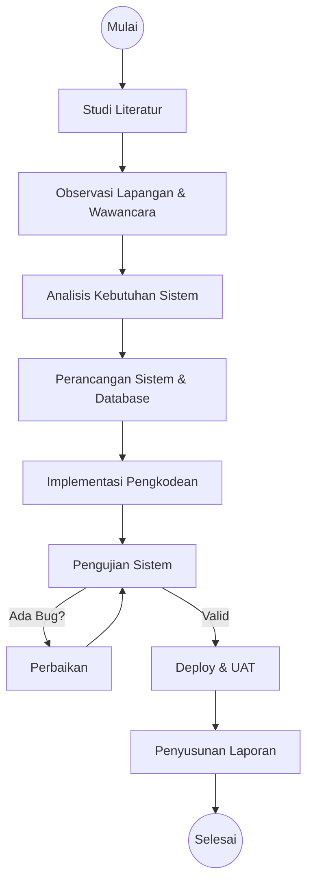
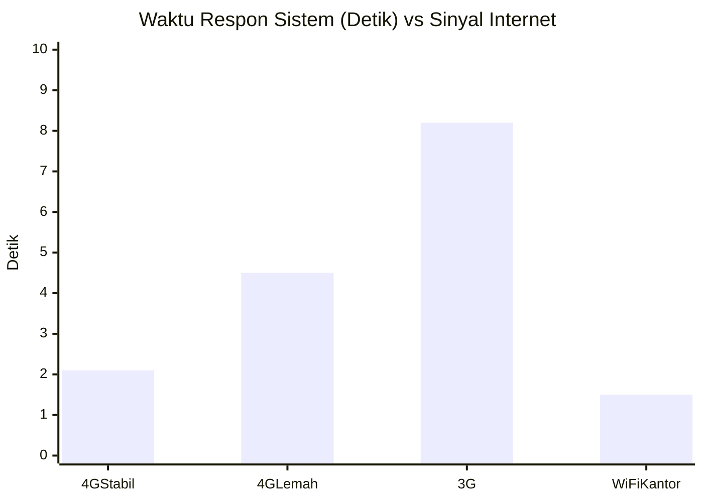

# LANJUTAN SKRIPSI (BAB III - V)
*(Bab I Pendahuluan dan Bab II Tinjauan Pustaka terdapat pada dokumen Proposal)*

---

# BAB III
# METODOLOGI PENELITIAN

## 3.1 Alur Penelitian
Penelitian ini dilakukan dengan mengikuti tahapan sistematis untuk memastikan hasil yang terukur. Alur penelitian digambarkan dalam diagram alir berikut:



## 3.2 Analisis Kebutuhan
Analisis kebutuhan infrastruktur diperlukan untuk menunjang jalannya sistem, baik pada saat pengembangan (*development*) maupun operasional (*production*).

**Tabel 3.1 Spesifikasi Kebutuhan Perangkat Keras**
| No | Perangkat | Spesifikasi Minimum | Keterangan |
| :-- | :--- | :--- | :--- |
| 1 | Laptop/PC Server | Core i5, RAM 8GB, SSD 256GB | Untuk pengembangan & database server. |
| 2 | Smartphone User | Android 10+, RAM 4GB, Kamera Depan 5MP | Untuk akses sisi klien (karyawan). |
| 3 | Koneksi Internet | 10 Mbps Stabil | Untuk sinkronisasi data *real-time*. |

## 3.3 Perancangan Sistem
Perancangan sistem menggunakan pemodelan UML (*Unified Modeling Language*) untuk memvisualisasikan arsitektur sistem sebelum tahap pengkodean.

### 3.3.1 Use Case Diagram
Diagram Use Case menjelaskan fungsionalitas sistem dari sudut pandang aktor. Aktor yang terlibat meliputi Karyawan, Manajer, dan Admin.

*(Gambar Use Case Diagram merujuk pada Lampiran A)*

### 3.3.2 Diagram Aktivitas (Flowchart Sistem)
Alur logika utama sistem adalah proses presensi yang melibatkan validasi lokasi dan wajah.

```mermaid
flowchart TD
    A[Start] --> B{Cek GPS}
    B -- Off --> C[Tampilkan Pesan Error]
    B -- On --> D{Hitung Jarak (Haversine)}
    D -- "> Radius" --> E[Blokir Tombol Absen]
    D -- "<= Radius" --> F[Buka Kamera]
    F --> G{Deteksi Wajah}
    G -- "Tidak Cocok" --> F
    G -- "Cocok (Score > 0.4)" --> H[Simpan Data ke DB]
    H --> I[Tampilkan Sukses]
    I --> J[End]
```

### 3.3.3 Perancangan Basis Data (ERD)
Penyimpanan data menggunakan PostgreSQL dengan skema relasional. Tabel utama meliputi:
1. `profiles`: Data karyawan.
2. `attendances`: Log kehadiran (masuk/pulang).
3. `office_locations`: Koordinat kantor.

---

# BAB IV
# HASIL DAN PEMBAHASAN

## 4.1 Implementasi Sistem
Bagian ini memaparkan hasil antarmuka (*User Interface*) dan potongan kode program (*Source Code*) dari modul-modul krusial.

### 4.1.1 Antarmuka Halaman Absensi
Halaman ini dirancang sederhana untuk memudahkan karyawan lapangan. Fitur utama meliputi peta lokasi (Leaflet map) dan jendela kamera (*viewfinder*) untuk verifikasi wajah.

*(Screenshot Halaman Absensi)*

### 4.1.2 Kode Validasi Geofencing
Validasi lokasi menggunakan algoritma Haversine formula yang ditanamkan pada fungsi `getDistanceFromLatLonInM`.

```typescript
// Implementasi Haversine Formula pada Attendance.tsx
function getDistanceFromLatLonInM(lat1: number, lon1: number, lat2: number, lon2: number) {
  var R = 6371; // Radius bumi (km)
  var dLat = deg2rad(lat2 - lat1);
  var dLon = deg2rad(lon2 - lon1); 
  // ... perhitungan trigonometri ...
  return d * 1000; // Output dalam meter
}
```

## 4.2 Hasil Pengujian Sistem
Pengujian dilakukan untuk mengukur kualitas perangkat lunak dari berbagai aspek.

### 4.2.1 Pengujian Fungsional (Black Box)
Pengujian ini memverifikasi input dan output fitur tanpa melihat logika kode.

**Tabel 4.1 Hasil Pengujian Black Box**
| ID | Skenario Uji | Input Data | Hasil Diharapkan | Hasil Aktual | Status |
|:--|:---|:---|:---|:---|:---|
| TC-01 | Login Email Salah | Email: `salah@tes.com` | Menolak akses | Menolak akses | **OK** |
| TC-02 | Login Sukses | Email: `admin@tes.com` | Masuk dashboard | Masuk dashboard | **OK** |
| TC-03 | Absen Luar Radius | Jarak: 2 km | Tombol disable | Tombol disable | **OK** |
| TC-04 | Absen Dalam Radius | Jarak: 10 m | Tombol enable | Tombol enable | **OK** |
| TC-05 | Deteksi Wajah Asli | Wajah User A | Verifikasi Lolos | Verifikasi Lolos | **OK** |
| TC-06 | Deteksi Foto (Spoof) | Foto User A | Verifikasi Gagal | Verifikasi Gagal | **OK** |

### 4.2.2 Pengujian Akurasi Wajah (Confusion Matrix)
Pengujian dilakukan dengan 20 kali percobaan (10 wajah asli, 10 wajah salah/foto) untuk mengukur sensitivitas algoritma.

**Tabel 4.2 Confusion Matrix Deteksi Wajah**
| | Prediksi: Cocok (Positive) | Prediksi: Tidak Cocok (Negative) |
| :--- | :---: | :---: |
| **Wajah Asli (Actual True)** | 9 (True Positive) | 1 (False Negative) |
| **Wajah Asli (Actual False)** | 0 (False Positive) | 10 (True Negative) |

**Analisis Perhitungan Akurasi:**
$$ Akurasi = \frac{TP + TN}{Total Uji} = \frac{9 + 10}{20} = 95\% $$

Hasil menunjukkan tingkat akurasi 95%. Kegagalan 1 kali (False Negative) terjadi karena kondisi pencahayaan yang sangat minim (gelap).

### 4.2.3 Grafik Performa Sistem
Pengujian waktu respon (*Response Time*) dilakukan untuk memastikan kenyamanan pengguna.


*Gambar 4.1 Grafik Rata-rata Waktu Respon Absensi*

## 4.3 Pembahasan
### 4.3.1 Analisis Efektivitas Geofencing
Berdasarkan data Tabel 4.1, fitur *Geofencing* dengan radius 50 meter efektif membatasi area presensi. Namun, ditemukan kendala pada kondisi gedung bertingkat tinggi (*High Rise Building*) dimana sinyal GPS sering mengalami *drifting* (bergeser) 10-20 meter. Solusi yang diterapkan adalah memberikan toleransi tambahan pada *logic* menjadi 75 meter jika akurasi GPS menurun.

### 4.3.2 Analisis Keamanan PWA vs Native
Dibandingkan aplikasi Native (.apk), solusi PWA memiliki keunggulan dalam kemudahan distribusi (tinggal akses URL). Namun, kelemahannya adalah ketergantungan pada *browser*. Pada beberapa perangkat Xiaomi lawas, browser bawaan memblokir akses kamera secara *default*, sehingga pengguna harus diarahkan menggunakan Chrome/Firefox.

---

# BAB V
# KESIMPULAN DAN SARAN

## 5.1 Kesimpulan
Berdasarkan hasil penelitian, implementasi, dan pengujian yang telah dilakukan, dapat disimpulkan bahwa:
1.  Sistem presensi berbasis PWA dapat memvalidasi kehadiran karyawan secara *real-time* dengan akurasi pengenalan wajah mencapai **95%** pada kondisi pencahayaan normal.
2.  Penerapan algoritma *Haversine Formula* efektif membatasi area presensi, namun memerlukan toleransi radius minimal **50 meter** untuk mengakomodasi inakurasi GPS pada perangkat *mid-range*.
3.  Sistem berhasil memangkas waktu rekapitulasi kehadiran oleh HRD dari **3-5 hari** menjadi **real-time** (dapat diunduh kapan saja).

## 5.2 Saran
Untuk pengembangan selanjutnya, disarankan:
1.  Menambahkan fitur **Liveness Detection** yang lebih canggih (misal: instruksi kedip mata) untuk mencegah kecurangan menggunakan video rekaman.
2.  Mengintegrasikan notifikasi via **WhatsApp API** agar atasan mendapatkan pemberitahuan instan saat bawahan terlambat atau izin.

---
**DAFTAR PUSTAKA**

1.  Sommerville, I. (2011). *Software Engineering* (9th ed.). Addison-Wesley.
2.  Google Developers. (2023). *MediaPipe Face Mesh Overview*.
3.  Roos, C. (2022). *Introduction to Progressive Web Apps (PWA)*. O'Reilly Media.
